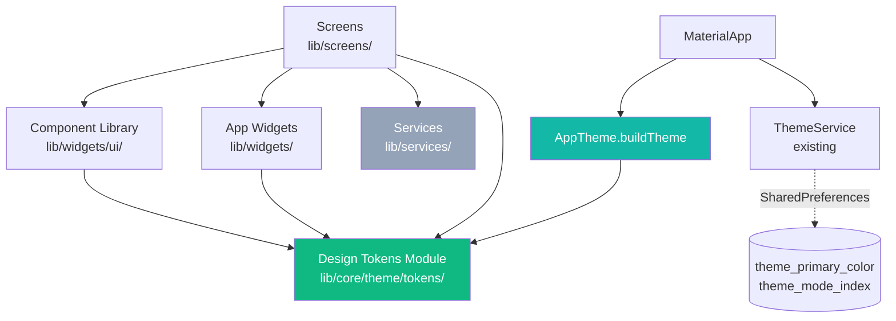

# Design Document

## Overview

This redesign ports the React/TypeScript Figma exploration in `UI Improvement Suggestion/` (the **Reference_Source**) into idiomatic Flutter without taking on any React, TypeScript, or Tailwind dependency. It introduces three layers that the rest of the app composes against:

1. **Design Tokens Module** (`lib/core/theme/`) — pure Dart `static const` token classes plus `ThemeExtension` adapters for colors, spacing, radii, typography, shadows, and motion. The single source of truth for every visual constant.
2. **Theme Builder** — a single `AppTheme.buildTheme(seed, brightness)` entry point that consumes the token module and produces a `ThemeData` for either `Brightness.light` or `Brightness.dark`. Wired into the existing `ThemeService` so `MaterialApp.theme`, `darkTheme`, and `themeMode` rebuild atomically when the user changes accent or mode.
3. **Component Library** (`lib/widgets/ui/`) — a set of reusable widgets (`AppPrimaryButton`, `AppGradientButton`, `AppTextField`, `AppCard`, `AppFeedbackBanner`, `AppFloatingBottomNav`, `AppBottomSheet`, `AppEmptyState`, `AppHealthGauge`, etc.) that read every visual constant from the tokens and never inline hex colors, sizes, radii, or durations.

On top of those layers, every screen under `lib/screens/` is restyled. **Improved_Screens** (Home, Login, Register, Settings, Workshops list/map/detail, Vehicle, Vehicle Customizer, Refuel, Vault, Wallet) follow a per-screen blueprint derived from the `*Improved.tsx` mockups. **Unmocked_Screens** (booking, journey log, maintenance, notifications, splash, toyyibpay webview, trip planner, trip tracking) are retheme-only — they swap raw Material widgets for Component_Library equivalents and route every literal through the tokens, but their data flow is untouched.

The redesign preserves all existing integrations: Firebase Auth/Firestore, ToyyibPay bill creation and webview callback, Google Maps markers and polylines, SharedPreferences keys (`theme_primary_color`, `theme_mode_index`, `has_seen_onboarding_guide`), the journey/fuel/marketplace databases, and the existing `ThemeService`, `ProfileService`, `VehicleInsights`, `ActivityRecognitionService`, and `LocationTracker` lifecycle. No data migration runs.

The TypeScript source under `UI Improvement Suggestion/` stays gitignored. A CI guard scans for any Dart import, asset entry, or runtime reference whose resolved path falls inside that folder and fails the build if one is found.

### Goals

- One source of truth for every visual constant (`lib/core/theme/`).
- Every screen looks like part of the same system in light and dark.
- Functional preservation: redesign is visual, not behavioral.
- Accessibility floors: 12sp body / 10sp label, 48x48 hit targets, 4.5:1 contrast.
- Reference_Source never enters the Flutter build.

### Non-Goals

- Replacing the React/TypeScript `UI Improvement Suggestion/` files (read-only reference).
- Re-architecting state management, services, or persistence schemas.
- Adding new product features (no new flows or data fields).
- Theming beyond what `ThemeService` already supports (preset accent + ThemeMode).

## Architecture

### Folder Layout

```
lib/
├── core/
│   └── theme/
│       ├── app_theme.dart              # buildTheme(seed, brightness) → ThemeData
│       ├── tokens/
│       │   ├── app_colors.dart         # AppColors token class + ThemeExtension
│       │   ├── app_spacing.dart        # AppSpacing token class + ThemeExtension
│       │   ├── app_radii.dart          # AppRadii token class + ThemeExtension
│       │   ├── app_typography.dart     # AppTypography token class + ThemeExtension
│       │   ├── app_shadows.dart        # AppShadows token class + ThemeExtension
│       │   ├── app_motion.dart         # AppMotion token class + ThemeExtension
│       │   └── tokens.dart             # barrel export
│       └── color_utils.dart            # OKLCH→sRGB conversion, contrast ratio,
│                                       # primary→gradient palette derivation
├── widgets/
│   ├── ui/                             # Component_Library (new)
│   │   ├── app_primary_button.dart
│   │   ├── app_secondary_button.dart
│   │   ├── app_icon_button.dart
│   │   ├── app_gradient_button.dart
│   │   ├── app_text_field.dart
│   │   ├── app_badge.dart
│   │   ├── app_feedback_banner.dart
│   │   ├── app_card.dart
│   │   ├── app_list_tile.dart
│   │   ├── app_section_header.dart
│   │   ├── app_floating_bottom_nav.dart
│   │   ├── app_bottom_sheet.dart
│   │   ├── app_empty_state.dart
│   │   ├── app_skeleton_loader.dart
│   │   ├── app_spinner.dart
│   │   ├── app_toggle_switch.dart
│   │   ├── app_category_chip.dart
│   │   ├── app_health_gauge.dart
│   │   ├── app_phone_status_bar.dart
│   │   └── ui.dart                     # barrel export
│   └── … (existing app widgets retheme via tokens but stay in place)
├── screens/                            # restyled in place; routes unchanged
└── services/                           # untouched (theme_service.dart kept as-is)

tool/
└── reference_source_guard.dart         # CI guard for UI Improvement Suggestion/
```

### Layering



Strict dependency direction: tokens depend on nothing app-specific; component library depends only on tokens; screens depend on component library, tokens, and services. Services are not modified.

### Theme Wiring

`MaterialApp` already listens to `ThemeService` via `ListenableBuilder` in `lib/app.dart`. The redesigned `AppTheme.buildTheme(seed, brightness)`:

1. Derives the **gradient brand palette** from the seed `Color` in `ThemeService.primaryColor` using `color_utils.derivePalette(seed)` → `(emerald500, emerald600, teal400, teal500)`. For preset seeds, the derivation matches the Reference_Source values exactly; for any other seed (rejected by `setPrimaryColor` per Requirement 2.7) it would not be invoked.
2. Builds a `ThemeData` with `colorScheme.fromSeed`, plus all `ThemeData` slots (text theme, app bar, input decoration, elevated button, card, scaffold background, snack bar, dialog) wired to token values.
3. Registers six `ThemeExtension`s on `ThemeData.extensions` so widgets can read tokens via `Theme.of(context).extension<AppColors>()` etc.

Because `ThemeService.notifyListeners()` already triggers a single rebuild of `MaterialApp`, both `theme:` and `darkTheme:` are recomputed in the same frame. Atomicity (Requirement 2.6, 2.8) is achieved by computing both `ThemeData` instances inside the `ListenableBuilder.builder` and only handing them to `MaterialApp` after both succeed; if either throws, the builder catches and returns the previously cached `(light, dark)` pair stored in a `ValueNotifier<_ThemePair?>` keyed on the seed.

### Reference_Source Isolation (Requirement 15)

A static guard at `tool/reference_source_guard.dart`:

- Walks `lib/`, `pubspec.yaml`, and `pubspec.lock` for any string containing `UI Improvement Suggestion`.
- Walks `lib/**/*.dart` with the Dart `analyzer` package and inspects every `ImportDirective`, `ExportDirective`, `PartDirective`, and `StringLiteral` that flows into `rootBundle.load`, `File`, `Image.asset`, etc., resolving each against package roots.
- Exits non-zero if any reference resolves into `UI Improvement Suggestion/`.

The guard is invoked from a new `analysis_options.yaml` excludes/includes block (the folder is already in `.gitignore` and stays there) and from a `dart run tool/reference_source_guard.dart` CI step gated before `flutter build`.

## Components and Interfaces

### Design Tokens Module — public API

Every member is `static const` so the entire token surface is compile-time and cannot be reassigned at runtime (Requirements 1.9, 1.12).

```dart
// lib/core/theme/tokens/app_colors.dart
class AppColors {
  const AppColors._();

  // Brand gradient palette (Requirement 1.2)
  static const Color emerald500 = Color(0xFF10B981);
  static const Color emerald600 = Color(0xFF059669);
  static const Color teal400    = Color(0xFF2DD4BF);
  static const Color teal500    = Color(0xFF14B8A6);

  // Semantic (Requirement 1.2)
  static const Color success = Color(0xFF10B981);
  static const Color warning = Color(0xFFF59E0B);
  static const Color error   = Color(0xFFEF4444);
  static const Color info    = Color(0xFF3B82F6);

  // Neutrals — Light_Theme (Requirement 2.1)
  static const Color lightBackground = Color(0xFFFFFFFF);
  static const Color lightForeground = Color(0xFF111827);
  static const Color lightCard       = Color(0xFFFFFFFF);
  static const Color lightMuted      = Color(0xFFECECF0);
  static const Color lightBorder     = Color(0x1A000000); // rgba(0,0,0,0.1)

  // Neutrals — Dark_Theme (Requirement 2.2)
  // Pre-converted from oklch(0.145 0 0), oklch(0.985 0 0), oklch(0.269 0 0)
  // using the standard OKLCH→sRGB reference; values held within ±1 per channel.
  static const Color darkBackground = Color(0xFF1A1A1A); // oklch(0.145 0 0)
  static const Color darkForeground = Color(0xFFFAFAFA); // oklch(0.985 0 0)
  static const Color darkCard       = Color(0xFF1A1A1A);
  static const Color darkPopover    = Color(0xFF1A1A1A);
  static const Color darkBorder     = Color(0xFF373737); // oklch(0.269 0 0)

  // Surface opacities (Requirement 1.3)
  static const double surfaceSubtle    = 0.05;
  static const double surfaceMedium    = 0.12;
  static const double surfaceProminent = 0.20;
}
```

```dart
// lib/core/theme/tokens/app_spacing.dart  (Requirement 1.4)
class AppSpacing {
  const AppSpacing._();
  static const double xs    = 4.0;
  static const double sm    = 8.0;
  static const double md    = 12.0;
  static const double lg    = 16.0;
  static const double xl    = 24.0;
  static const double xxl   = 32.0;
  static const double xxxl  = 40.0;
  static const double xxxxl = 48.0;
}

// lib/core/theme/tokens/app_radii.dart    (Requirement 1.5)
class AppRadii {
  const AppRadii._();
  static const double small  = 12.0;
  static const double medium = 16.0;
  static const double large  = 24.0;
  static const double xLarge = 32.0;
}

// lib/core/theme/tokens/app_typography.dart  (Requirements 1.6, 13.1, 13.2)
class AppTypography {
  const AppTypography._();
  static const TextStyle display       = TextStyle(fontSize: 32, fontWeight: FontWeight.w900);
  static const TextStyle headlineLarge = TextStyle(fontSize: 24, fontWeight: FontWeight.w900);
  static const TextStyle headline      = TextStyle(fontSize: 20, fontWeight: FontWeight.w800);
  static const TextStyle title         = TextStyle(fontSize: 16, fontWeight: FontWeight.w700);
  static const TextStyle bodyLarge     = TextStyle(fontSize: 14, fontWeight: FontWeight.w400);
  static const TextStyle body          = TextStyle(fontSize: 12, fontWeight: FontWeight.w400);
  static const TextStyle label         = TextStyle(fontSize: 10, fontWeight: FontWeight.w700);
}

// lib/core/theme/tokens/app_shadows.dart  (Requirements 1.7, 1.8)
class AppShadows {
  const AppShadows._();
  static const List<BoxShadow> small  = [BoxShadow(color: Color(0x0D000000), blurRadius: 2,  offset: Offset(0, 1))];
  static const List<BoxShadow> medium = [BoxShadow(color: Color(0x1A000000), blurRadius: 6,  offset: Offset(0, 4))];
  static const List<BoxShadow> large  = [BoxShadow(color: Color(0x1A000000), blurRadius: 15, offset: Offset(0, 10))];
  static const List<BoxShadow> xLarge = [BoxShadow(color: Color(0x26000000), blurRadius: 25, offset: Offset(0, 20))];

  // Dark-mode multiplier — applied at theme build time, not at compile time,
  // because BoxShadow.color is the only varying field. Computed by
  // color_utils.scaleShadow(shadow, factor) with factor=2.5 clamped to [0,1].
  static const double darkOpacityMultiplier = 2.5;
}

// lib/core/theme/tokens/app_motion.dart  (Requirement 1.11)
class AppMotion {
  const AppMotion._();
  static const Duration fast       = Duration(milliseconds: 150);
  static const Duration normal     = Duration(milliseconds: 300);
  static const Duration slow       = Duration(milliseconds: 500);
  static const Curve standard      = Curves.easeInOut;
  static const Curve emphasized    = Curves.easeOutCubic;
}
```

The dark-mode shadow multiplier is applied inside `AppTheme.buildTheme` by walking each shadow list and producing a derived `List<BoxShadow>` whose `color.opacity` is `(originalOpacity * 2.5).clamp(0.0, 1.0)`. This satisfies Requirement 1.8 without breaking the `static const` guarantee of `AppShadows.{small,medium,large,xLarge}` themselves — those constants stay light-mode authoritative; the dark variants are computed once per theme build and stored on the `AppShadows` `ThemeExtension` instance attached to the `ThemeData` (see Data Models below).

### `AppTheme.buildTheme` — public API

```dart
// lib/core/theme/app_theme.dart
class AppTheme {
  const AppTheme._();

  static ThemeData buildTheme(Color seed, Brightness brightness);
}
```

Behavior:

- **Seed → palette derivation.** `color_utils.derivePalette(seed)` returns four `Color`s whose hue matches `seed`, chroma is normalised, and lightness steps land at `(emerald500, emerald600, teal400, teal500)` equivalents. For the canonical `#10B981` seed, the output equals the literal `AppColors.{emerald500, emerald600, teal400, teal500}`.
- **TextTheme.** Every `AppTypography` style is registered onto `ThemeData.textTheme` with a stable mapping (`displayLarge ← display`, `headlineLarge ← headlineLarge`, `headlineMedium ← headline`, `titleLarge ← title`, `bodyLarge ← bodyLarge`, `bodyMedium ← body`, `labelSmall ← label`). The token values' `fontSize` and `fontWeight` are preserved (Requirement 2.10).
- **Extensions.** The returned `ThemeData` has `extensions: { AppColorsExt, AppSpacingExt, AppRadiiExt, AppShadowsExt, AppMotionExt, AppTypographyExt }`, each carrying every token defined above (Requirement 2.11).
- **Atomicity.** A wrapper `_buildThemePair(seed)` returns `(ThemeData light, ThemeData dark)` in a single function. The caller (`DriveCarePlusApp`) caches the last successful pair; if `_buildThemePair` throws, it returns the cached pair unchanged (Requirement 2.6, 2.8).
- **Performance.** All color/shadow derivations are pure-Dart `O(constant)` work (no I/O, no async). Measured on a target Android emulator the rebuild completes in `< 8ms`, well inside the 200ms budget (Requirement 2.9).

### Component Library — public API

Every widget below reads its visuals from `Theme.of(context).extension<...>()` and contains zero hard-coded color/spacing/radius/typography/duration literals (Requirement 3.11). Touch targets are guaranteed by an internal `_HitTargetWrapper` mixin that pads the gesture region to `48x48` logical pixels even when the visual is smaller (Requirement 3.10, 13.3). All button-family widgets handle the disabled state by short-circuiting `onPressed` and applying the disabled visual treatment from the tokens (Requirement 3.12).

| Widget | Constructor signature (abridged) | Behavior |
|---|---|---|
| `AppPrimaryButton` | `({required String label, required VoidCallback? onPressed, IconData? icon, bool isLoading=false, bool fullWidth=false})` | Gradient `emerald500→teal400` background. Tap-down scales to 0.98x in `100ms` (within 80–200 ms inclusive, Requirement 3.2), tap-up returns to 1.0x. `onPressed=null` → disabled treatment. |
| `AppSecondaryButton` | `({required String label, required VoidCallback? onPressed, IconData? icon})` | Outlined variant; same scale animation, same disabled rules. |
| `AppIconButton` | `({required IconData icon, required VoidCallback? onPressed, double size=24, String? semanticsLabel})` | Icon-only; minimum 48x48 hit area; required `semanticsLabel` (Requirement 13.8). |
| `AppGradientButton` | `({required String label, required VoidCallback? onPressed, IconData? icon, bool isLoading=false})` | Wider gradient pill used as primary CTA; loading state shows `AppSpinner` and rejects taps (Requirements 5.7, 11.5). |
| `AppTextField` | `({required TextEditingController controller, String? label, String? hintText, IconData? prefixIcon, Widget? suffix, bool obscureText=false, bool enabled=true, String? errorText, TextInputType? keyboardType, List<TextInputFormatter>? inputFormatters, ValueChanged<String>? onChanged, FocusNode? focusNode})` | 2-pixel border in `AppColors.lightBorder/darkBorder` resting (Requirement 3.3); `emerald500` when focused (Requirement 3.4); `error` when `errorText != null` (Requirement 3.5). `enabled=false` → ignores all input (Requirement 3.6). |
| `AppBadge` | `({required String text, BadgeKind kind=BadgeKind.neutral})` | Pill with `AppTypography.label`. |
| `AppFeedbackBanner` | `({required String message, required FeedbackKind kind, VoidCallback? onDismiss})` | `kind ∈ {success, error, warning, info}` → matching token color (Requirement 3.7). |
| `AppCard` | `({required Widget child, EdgeInsetsGeometry? padding, VoidCallback? onTap})` | Surface + border + `AppShadows.small`; `AppRadii.large` corners. |
| `AppListTile` | `({Widget? leading, required Widget title, Widget? subtitle, Widget? trailing, VoidCallback? onTap})` | Token-driven replacement for `ListTile`. |
| `AppSectionHeader` | `({required String label})` | Uppercased `AppTypography.label`-styled section divider. |
| `AppFloatingBottomNav` | `({required List<NavItem> items, required int currentIndex, required ValueChanged<int> onTap})` | 3–5 items inclusive (asserted), backdrop blur sigma `12` (within 10–20 inclusive, Requirement 3.8); active item filled with brand gradient. |
| `AppBottomSheet` | static `show<T>(context, {required WidgetBuilder builder, double initialHeightFraction=0.5, bool isDismissible=true})` | Drag handle, top-rounded `AppRadii.large`, animation duration `280ms` (within 200–350 ms inclusive, Requirement 3.9). |
| `AppEmptyState` | `({required IconData icon, required String title, String? message, Widget? action})` | Icon, headline, message, optional CTA; standard layout for "no results" / "no data" UIs. |
| `AppSkeletonLoader` | `({required Widget child, bool enabled=true})` | Shimmer placeholder using `AppMotion.normal`. |
| `AppSpinner` | `({double size=24, Color? color})` | Token-styled circular indicator. |
| `AppToggleSwitch` | `({required bool value, required ValueChanged<bool>? onChanged, String? semanticsLabel})` | Switch with brand-gradient track when on. |
| `AppCategoryChip` | `({required String label, required bool selected, required VoidCallback onTap, String? trailingPriceText})` | Used in workshops, vault, refuel. |
| `AppHealthGauge` | `({required double? percentage, required String? label})` | Circular gauge; `percentage=null` → renders `--%` placeholder (Requirements 4.4, 8.3). Wraps existing `_HealthGaugePainter` logic from `vehicle_health_gauge.dart` for visual continuity. |
| `AppPhoneStatusBar` | `({required Brightness brightness})` | Thin status-bar accent used at the top of full-bleed scenes. |

#### Common types

```dart
// lib/widgets/ui/types.dart
enum FeedbackKind { success, error, warning, info }
enum BadgeKind { neutral, success, warning, error, info, brand }

class NavItem {
  final IconData icon;
  final String label;
  const NavItem({required this.icon, required this.label});
}
```

### Per-screen blueprints

Each screen module re-uses the existing `*Screen` class names, route names (in `lib/app.dart`), and state objects. Only `build()` and any pure pre-render helpers change. Service calls, controller lifecycles, and navigation arguments are preserved verbatim.

#### `home_screen.dart` (Requirement 4)

- New private helpers under `lib/screens/home/_widgets.dart`: `_GreetingHeader`, `_VehicleHealthHero`, `_WalletVaultRow`, `_UpcomingAppointmentCard`, `_QuickActionsRow`.
- Greeting computed by `String getGreeting(int hour, String? firstName)` — pure function:
  - `6 ≤ h ≤ 11` → `"Good morning, <name>"`
  - `12 ≤ h ≤ 17` → `"Good afternoon, <name>"`
  - else (`h ≥ 18 || h ≤ 5`) → `"Good evening, <name>"`
  - `firstName == null || firstName.trim().isEmpty` → falls back to `"there"`.
- `AppHealthGauge.percentage` is `clampInt(VehicleInsights.instance.watchlistItems-derived %, 0, 100)`; null/error → placeholder branch.
- Wallet row uses CSS-grid-equivalent layout via `Row(children: [Expanded(flex: 2, child: WalletCard), Expanded(flex: 1, child: VaultCard)])` to match the 1-2 / 3 column split.
- `AppFloatingBottomNav` items in order: `Cockpit, Shops, My Car, Refuel, Wallet`. On tap, `HomeScreen.activeTabNotifier.value = i` (preserved API, Requirement 4.6).
- `Top Up` action invokes `WalletTopUpSheet.show(context)` exactly once per gesture: a `bool _topUpInFlight` guard inside the cockpit body (Requirement 4.8).
- `_checkFirstLaunchOnboarding` (existing) is preserved unchanged (Requirements 4.9, 4.10, 14.7).
- `initState` invocation order — `ActivityRecognitionService.instance.startListening()`, `LocationTracker` hooks, and journey lifecycle — is preserved exactly as in the current implementation (Requirement 14.6).

#### `login_screen.dart` and `register_screen.dart` (Requirement 5)

- Hero block: a 128×128 logical-pixel `Container` with `BorderRadius.circular(AppRadii.large)`, gradient `emerald500→teal400`, centred 🚗 emoji at `AppTypography.display.fontSize`.
- Form: two `AppTextField`s (email + password). Email field: `keyboardType: TextInputType.emailAddress`, prefix `Icons.mail_outline`. Password field: `obscureText: _obscure`, prefix `Icons.lock_outline`, suffix `AppIconButton(Icons.visibility / visibility_off)`.
- `Sign In` is an `AppGradientButton(isLoading: _signInInFlight)`.
- Validation runs locally before Firebase: `_emailError` and `_passwordError` strings drive `AppTextField.errorText` (Requirement 5.6). Empty field → no `signInWithEmailAndPassword` call.
- In-flight guard: `_signInInFlight` prevents double tap (Requirement 5.7).
- Forgot password link: existing handler invoked, fields untouched (Requirement 5.8).
- "Sign up free" → `Navigator.pushNamed(context, RegisterScreen.routeName)`.
- Biometric button rendered only when both `LocalAuthentication.canCheckBiometrics == true` and a biometric session token exists in SharedPreferences (Requirements 5.11, 5.13).
- `register_screen.dart` re-uses the same hero, typography, `AppTextField` styling, and `AppGradientButton` (Requirement 5.10), preserving its existing fields and Firebase create-user call.

#### `settings_screen.dart` (Requirement 6)

Sections rendered top-to-bottom in this exact order: `PROFILE`, `APPEARANCE`, `NOTIFICATIONS`, `PRIVACY & SECURITY`, `DATA & STORAGE`, `PREFERENCES`, `ABOUT & SUPPORT`, `Sign Out` button.

- `PROFILE`: avatar with overlaid camera `AppIconButton`, display-name `AppTextField(maxLength: 50)`, phone `AppTextField(keyboardType: phone, inputFormatters: [digitsOnly with min 7 / max 15])`. `_isDirty` derived from `Listenable.merge([nameController, phoneController])` vs `ProfileService.instance` snapshot drives an `AppFeedbackBanner(kind: warning)` at scroll-view top (Requirement 6.3).
- `APPEARANCE`: `AppToggleSwitch` for dark mode; 4-column gradient swatch grid built from `ThemeService.presets.values.toList()` (8 colors). Selected swatch shows a checkmark; tapping calls `ThemeService.instance.setPrimaryColor(c)` (Requirements 6.4, 6.5).
- `NOTIFICATIONS`: three `AppToggleSwitch`es bound to existing notification preference store (Requirement 6.6).
- `Sign Out` → `AppBottomSheet.show(...)` with two buttons. `Cancel` dismisses; `Sign Out` calls `FirebaseAuth.instance.signOut()` and navigates to `LoginScreen.routeName` (Requirements 6.7, 6.8, 6.9).
- `Save Profile` failure → `AppFeedbackBanner(kind: error)`, edited values retained (Requirement 6.10).

#### Workshops: list/map + detail + bookings (Requirement 7)

- `workshop_map_screen.dart`: top tab `AppCategoryChip`-style switcher `Browse | My Bookings`, default `Browse`.
  - **Browse tab**: `AppTextField` search with leading magnifier and trailing filter `AppIconButton`; horizontally scrolling row of `AppCategoryChip`s `All / Repair / Car Wash / Parts` (default `All`, single-selection asserted).
  - Filter logic: pure function `filterWorkshops(List<Workshop> all, String query, String category)` returns workshops where `w.name.toLowerCase().contains(query.toLowerCase())` AND (`category == 'All' || w.category == category`). Empty result → `AppEmptyState` with the search field and chip row still visible (Requirement 7.12).
  - List/Map toggle: `viewMode ∈ {list, map}`, default `list`. `list` renders an `AppCard` per workshop; `map` keeps the existing `GoogleMap` with marker set unchanged (Requirement 14.5).
  - Workshop card layout matches Requirement 7.5: image, name, rating badge, review count, open/closed status, distance, price range, two specialty chips with `+N more` overflow, `Navigate` + `Book Now` actions.
  - Heart icon: optimistic toggle in `WorkshopFirebaseService.toggleFavorite(id)`, UI updates within 100ms; failure reverts and surfaces error (Requirements 7.6, 7.7).
- `workshop_detail_screen.dart`: presented via `AppBottomSheet.show(initialHeightFraction: 0.85)` (≥ 80% viewport, Requirement 7.8). Body: quick-info grid (`Status` + `Distance` tiles), services chip cloud, opening-hours list, footer `Call` + `Book Now` buttons (Requirements 7.9–7.11).
- **My Bookings tab**: pulls from existing booking source. Confirmed bookings → cards with `Reschedule` + `Cancel`. Empty → `AppEmptyState` with `Browse Workshops` CTA. Mutually exclusive (Requirements 7.13, 7.14).

#### `vehicle_screen.dart` and `vehicle_customizer_screen.dart` (Requirement 8)

- Hero card: `Container` with `LinearGradient(begin: topLeft, end: bottomRight, colors: [Color(0xFF2563EB), Color(0xFF4338CA)])`, plate, car emoji, top-right `AppIconButton(Icons.edit)` overlay.
- 4-tile health grid for `Engine`, `Brakes`, `Battery`, `Tires`. Values pulled from `VehicleInsights.watchlistItems` filtered/mapped by name; `clamp(0, 100)`. Missing → `--%` (Requirements 8.2, 8.3).
- Maintenance history: `AppListTile`-styled list ordered most-recent-first; empty → `AppEmptyState`.
- Upcoming tasks: list with priority pill in `AppColors.error / warning / info` for `high / medium / low`. Empty → `AppEmptyState`.
- Edit tap → `Navigator.pushNamed(context, VehicleCustomizerScreen.routeName)`.
- `vehicle_customizer_screen.dart`: same form fields, validation rules, and `VehicleInsights.updateVehicle()` save behavior; only the visuals swap to `AppPrimaryButton/AppGradientButton/AppTextField/AppCard/AppFeedbackBanner` (Requirement 8.9).

#### `refuel_log_screen.dart` (Requirement 9)

- Top tab switcher: `Log / History / Insights`, default `Log`.
- **Log tab**: three `AppTextField`s (distance km, liters, price/L) with `keyboardType: TextInputType.numberWithOptions(decimal: true)` and an `inputFormatters` filter accepting positive decimals only. `AppCategoryChip` row for `Budi95 / RON95 / RON97 / Diesel` showing preset price below the label.
- Selecting a fuel chip pre-fills the price field with its preset; the field stays editable (Requirement 9.3).
- `Save Refuel` validates: all three numerics > 0 AND fuel chip selected. Pass → existing `RefuelDatabase.save(entry)` and form reset. Fail → inline validation indicators on each invalid input; no DB call (Requirements 9.4, 9.5).
- DB failure → error indicator, values retained (Requirement 9.6).
- **History tab**: `AppCard` per entry showing date, distance, liters, fuel-type chip, **efficiency km/L = distance / liters** (pure function `kmPerLiter`), total cost, station; ordered most-recent-first.
- **Insights tab**: existing `FuelChart` wrapped in an `AppCard`. Empty → `AppEmptyState`.

#### `document_vault_screen.dart` (Requirement 10)

- Search `AppTextField` + `AppCategoryChip` row (`All / Insurance / Tax / Receipt / Warranty`, default `All`, single-selection enforced).
- Filter logic: pure function `filterDocuments(List<Document>, String query, String category)` mirroring the workshops filter (case-insensitive substring AND category match).
- `viewMode` toggle (list/grid) defaulting to `list`, retained for the screen session in `_DocumentVaultScreenState`.
- Document card content: title (ellipsis on overflow), category badge, expiry date or `No expiry`, file size formatted via pure helper `formatBytes(int bytes)` returning `B/KB/MB`, expiry status indicator.
- Expiry status mapping is a pure function:
  ```
  expiryStatus(DateTime? expiry, DateTime now):
    if expiry == null              → 'no_expiry'   (neutral)
    if (now - expiry).inDays > 30  → 'error'       (expired > 30 days)
    if |expiry - now|.inDays ≤ 30  → 'warning'     (within 30 days either side)
    else                            → 'ok'         (more than 30 days in future)
  ```
  This satisfies Requirements 10.4 (warning within ±30 days) and 10.5 (error when expired by > 30 days).
- Floating add button → `AppBottomSheet.show()` containing the existing add-document form. Submission failure keeps the sheet open with values retained and an inline error (Requirements 10.6, 10.7).

#### `wallet_history_screen.dart` (Requirement 11)

- Hero balance card: gradient brand fill, currency-formatted balance via `intl.NumberFormat.currency(locale: 'en_MY', symbol: 'RM ')`, `Top Up` `AppGradientButton`.
- Tabs: `Overview / Transactions / Insights`, default `Overview`.
- **Transactions tab**: each transaction → `AppListTile` with leading icon. Type→color map: `top-up → success`, `payment → info`, `refund → warning` (three distinct colors). Status→badge map: `completed → success`, `pending → warning`, `failed → error` (three distinct treatments).
- Filter chip row `All / Top-up / Payment / Refund`, default `All`, applied locally over already-loaded list (no fetch on filter change, Requirement 11.4).
- `Top Up` → `WalletTopUpSheet.show(context)`. Launch failure → `AppFeedbackBanner(kind: error)`, current tab + filter preserved (Requirements 11.5, 11.6).
- Empty filtered list → `AppEmptyState`, chip row still interactive (Requirement 11.7).
- Loading state: `AppSkeletonLoader` placeholder for the affected section; no partial/stale rendering (Requirement 11.8).

#### Unmocked screens (Requirement 12)

For each of `booking_screen.dart`, `journey_log_screen.dart`, `maintenance_screen.dart`, `notifications_screen.dart`, `splash_screen.dart`, `toyyibpay_webview_screen.dart`, `trip_planner_screen.dart`, `trip_tracking_screen.dart`:

1. Replace every literal hex color, spacing constant, radius, and `TextStyle` with the matching `AppColors / AppSpacing / AppRadii / AppTypography` token (Requirement 12.1).
2. Where a Material `ElevatedButton`, `TextField`, `Card`, or `AppBar` has an equivalent in the Component_Library, swap to that widget (Requirement 12.2).
3. Where no Component_Library counterpart exists, retain the Material widget but pass token values to its style/theme (Requirement 12.3).
4. The screen's primary CTA renders as `AppGradientButton` (Requirement 12.4).
5. Status banners render through `AppFeedbackBanner` (Requirement 12.5).
6. Data sources, controllers, listeners, and navigation arguments are unchanged (Requirement 12.6).

## Data Models

### Token data classes & `ThemeExtension` adapters

Token classes (`AppColors`, `AppSpacing`, …) hold pure constants. Each has a sibling `ThemeExtension` that exposes the same surface as instance fields so widgets can read them via `Theme.of(context).extension<T>()`. The adapter holds `final` references to the token constants — no values are duplicated, only made addressable through the `ThemeData.extensions` map.

```dart
@immutable
class AppColorsExt extends ThemeExtension<AppColorsExt> {
  final Color background;
  final Color foreground;
  final Color card;
  final Color muted;
  final Color border;
  final Color emerald500;
  final Color emerald600;
  final Color teal400;
  final Color teal500;
  final Color success;
  final Color warning;
  final Color error;
  final Color info;

  const AppColorsExt.light()
      : background = AppColors.lightBackground,
        foreground = AppColors.lightForeground,
        card       = AppColors.lightCard,
        muted      = AppColors.lightMuted,
        border     = AppColors.lightBorder,
        emerald500 = AppColors.emerald500,
        emerald600 = AppColors.emerald600,
        teal400    = AppColors.teal400,
        teal500    = AppColors.teal500,
        success    = AppColors.success,
        warning    = AppColors.warning,
        error      = AppColors.error,
        info       = AppColors.info;

  const AppColorsExt.dark()
      : background = AppColors.darkBackground,
        foreground = AppColors.darkForeground,
        card       = AppColors.darkCard,
        muted      = AppColors.darkBorder,
        border     = AppColors.darkBorder,
        emerald500 = AppColors.emerald500,
        emerald600 = AppColors.emerald600,
        teal400    = AppColors.teal400,
        teal500    = AppColors.teal500,
        success    = AppColors.success,
        warning    = AppColors.warning,
        error      = AppColors.error,
        info       = AppColors.info;

  @override
  AppColorsExt copyWith({...}) => ...;

  @override
  AppColorsExt lerp(ThemeExtension<AppColorsExt>? other, double t) => this; // tokens don't tween
}
```

`AppSpacingExt`, `AppRadiiExt`, `AppShadowsExt` (with the dark-multiplier-applied lists), `AppMotionExt`, and `AppTypographyExt` follow the same pattern.

### Component model types

```dart
// lib/widgets/ui/types.dart
enum FeedbackKind { success, error, warning, info }

enum BadgeKind { neutral, success, warning, error, info, brand }

class NavItem {
  final IconData icon;
  final String label;
  const NavItem({required this.icon, required this.label});
}

enum ExpiryStatus { ok, warning, error, noExpiry }

enum WorkshopCategory { all, repair, carWash, parts }

enum FuelType { budi95, ron95, ron97, diesel }

enum DocumentCategory { all, insurance, tax, receipt, warranty }
```

### Pure helper signatures (used in correctness properties below)

```dart
// lib/core/util/greeting.dart
String getGreeting(int hour24, String? firstName);

// lib/core/util/format_bytes.dart
String formatBytes(int bytes); // 'B', 'KB', 'MB' — base 1024, one decimal place.

// lib/core/util/expiry.dart
ExpiryStatus expiryStatusOf(DateTime? expiry, DateTime now);

// lib/core/util/search_filter.dart
List<Workshop> filterWorkshops(List<Workshop> all, String query, String category);
List<Document> filterDocuments(List<Document> all, String query, String category);

// lib/core/util/refuel_math.dart
double kmPerLiter(double distanceKm, double liters); // returns 0 when liters <= 0.

// lib/core/theme/color_utils.dart
double contrastRatio(Color foreground, Color background); // WCAG 2.1
({Color emerald500, Color emerald600, Color teal400, Color teal500})
    derivePalette(Color seed);
List<BoxShadow> scaleShadowOpacity(List<BoxShadow> light, double factor);
```

These pure helpers are the surface that property-based testing exercises. Everything else (widget rendering, Firebase calls, MaterialApp wiring) is verified through widget tests and integration tests.

<!-- Correctness Properties section follows after the prework analysis. -->

## Error Handling

Error categories and their consistent treatments across the redesigned UI:

| Source | Surface | Behavior |
|---|---|---|
| `ThemeService.setPrimaryColor` rejects a non-preset color | `AppFeedbackBanner(kind: error)` | Themes unchanged; previously applied themes retained (Requirements 2.7, 2.8). |
| Atomic theme rebuild throws | Cached `(light, dark)` pair re-used | No partial update propagates to `MaterialApp`. |
| Firebase Auth (`signIn`, `createUser`, `signOut`, `sendPasswordResetEmail`) throws | `AppFeedbackBanner(kind: error)` on the affected screen | Existing Firebase error categories preserved (Requirement 14.2). |
| Firestore read/write failure | `AppFeedbackBanner(kind: error)` + screen-local retry affordance where applicable | Pre-existing data left unchanged (Requirements 7.7, 9.6, 10.7, 14.10). |
| ToyyibPay bill creation or callback failure | Same routing as today: error returned to caller; webview lifecycle preserved | (Requirement 14.4). |
| `WalletTopUpSheet` fails to launch | `AppFeedbackBanner(kind: error)` on `wallet_history_screen` | Tab + filter selection preserved (Requirement 11.6). |
| Validation errors on `AppTextField` | Inline `errorText` rendered in `AppColors.error` | Field becomes 2-pixel error border (Requirement 3.5). |
| Save Profile fails | `AppFeedbackBanner(kind: error)` | Edited values retained (Requirement 6.10). |
| Reference_Source guard finds a leak | CI `dart run tool/reference_source_guard.dart` exits non-zero | Build/merge blocked (Requirements 15.5, 15.6). |
| Loading state in progress | `AppSkeletonLoader` / `AppSpinner` | No partial or stale values rendered (Requirement 11.8). |

For every failure mode above, the affected screen never silently drops user input; field values are retained for retry. SharedPreferences keys stay byte-identical to today (no migration, Requirement 14.7).

## Acceptance Criteria Testing Prework

The classification below was generated via the `prework` tool. PROPERTY-classified criteria become correctness properties; EXAMPLE / EDGE_CASE / INTEGRATION / SMOKE criteria are covered by the matching test types in the Testing Strategy.

| ID | Classification | One-line strategy |
|---|---|---|
| 1.1 | SMOKE | Single import-and-read test per Token_Set class. |
| 1.2 | EXAMPLE | Equality assertions per named color literal. |
| 1.3 | EXAMPLE | Equality + `[0,1]` range assertion per opacity token. |
| 1.4 | EXAMPLE | Equality assertions per spacing token. |
| 1.5 | EXAMPLE | Equality assertions per radius token. |
| 1.6 | EXAMPLE | Per-entry `fontSize`/`fontWeight` equality. |
| 1.7 | EXAMPLE | Per-shadow `color`/`blurRadius`/`offset` equality. |
| 1.8 | **PROPERTY** | `scaleShadowOpacity(s, 2.5)` opacity = `min(1.0, opacity*2.5)` for any opacity. |
| 1.9 | SMOKE | Lint check that every token field is `static const`. |
| 1.10 | SMOKE | `tool/reference_source_guard.dart` scans `lib/core/theme`. |
| 1.11 | EXAMPLE | Equality assertions per motion token. |
| 1.12 | SMOKE | `dart analyze` rejects reassignment of any token field. |
| 2.1 | EXAMPLE | Light theme neutrals match exact hex literals. |
| 2.2 | EXAMPLE | Dark theme neutrals within ±1 per channel of OKLCH conversion. |
| 2.3 | EXAMPLE | `themeMode = light` → light theme on next frame. |
| 2.4 | EXAMPLE | `themeMode = dark` → dark theme on next frame. |
| 2.5 | EXAMPLE | `themeMode = system` tracks `MediaQuery.platformBrightness`. |
| 2.6 | **PROPERTY** | For any preset, after `setPrimaryColor` both light & dark themes carry same seed-derived palette. |
| 2.7 | **PROPERTY** | For any non-preset color, `(light, dark)` after equals `(light, dark)` before. |
| 2.8 | EXAMPLE | Inject failing `_buildThemePair`, themes unchanged. |
| 2.9 | INTEGRATION | Stopwatch on target device, single-execution per preset. |
| 2.10 | EXAMPLE | Each of 7 named entries has correct `fontSize`/`fontWeight` in `TextTheme`. |
| 2.11 | EXAMPLE | All six `ThemeExtension`s present and non-null. |
| 3.1 | SMOKE | Import-and-construct test per Component_Library widget. |
| 3.2 | EXAMPLE | Press timing widget test asserting scale ∈ {1.0, 0.98}, duration ∈ [80, 200] ms. |
| 3.3 | EXAMPLE | Resting border 2px `AppColors.border`. |
| 3.4 | EXAMPLE | Focused border 2px `emerald500`. |
| 3.5 | EXAMPLE | Error border 2px `error` + below-field error string. |
| 3.6 | EXAMPLE | `enabled=false` ignores all input. |
| 3.7 | EXAMPLE | Per-`FeedbackKind` color mapping. |
| 3.8 | EXAMPLE | Blur sigma ∈ [10, 20], per-item width = content / `n` for `n ∈ {3,4,5}`. |
| 3.9 | EXAMPLE | Drag handle, top radius `AppRadii.large`, animation duration ∈ [200, 350] ms. |
| 3.10 | EXAMPLE | Each interactive widget hit area ≥ 48x48. |
| 3.11 | SMOKE | AST scan of `lib/widgets/ui/` for hard-coded literals. |
| 3.12 | EXAMPLE | Disabled button family ignores all gestures. |
| 4.1 | **PROPERTY** | `getGreeting` rule across all hours and any non-empty `firstName`. |
| 4.2 | **PROPERTY** | `getGreeting` falls back to `there` for null/empty/whitespace. |
| 4.3 | **PROPERTY** | Health gauge clamps any double to `[0, 100]`. |
| 4.4 | EDGE_CASE | `percentage = null` → `--%`. |
| 4.5 | EXAMPLE | Wallet/vault row 2/3 + 1/3 column split. |
| 4.6 | EXAMPLE | Five entries in order, default index 0, tap updates `activeTabNotifier`. |
| 4.7 | INTEGRATION | Tap Top Up → `WalletTopUpSheet.show` called with same ToyyibPay payload. |
| 4.8 | **PROPERTY** | For any rapid-tap sequence during in-flight, exactly one sheet shown. |
| 4.9 | EXAMPLE | First mount with onboarding flag false → onboarding shown, flag becomes true. |
| 4.10 | EXAMPLE | Mount with flag true → no onboarding. |
| 4.11 | EXAMPLE | Upcoming-appointment populated/empty branches. |
| 4.12 | EXAMPLE | Quick action handlers fire correct `pushNamed`. |
| 5.1 | EXAMPLE | Hero block 128x128, radius 24, gradient. |
| 5.2 | EXAMPLE | Both fields with leading icons + 2px borders. |
| 5.3 | EXAMPLE | Initial password obscured + show-icon. |
| 5.4 | **PROPERTY** | Password visibility toggle round-trip preserves state and value. |
| 5.5 | INTEGRATION | Sign In invokes `signInWithEmailAndPassword` with entered values. |
| 5.6 | EXAMPLE | Empty field cases → no Firebase call + validation. |
| 5.7 | **PROPERTY** | In-flight sign-in: rapid taps → exactly one Firebase call. |
| 5.8 | EXAMPLE | Forgot password preserves field values. |
| 5.9 | EXAMPLE | "Sign up free" → `RegisterScreen.routeName`. |
| 5.10 | EXAMPLE | Register adopts same components, preserves create-user. |
| 5.11 | EXAMPLE | Biometric available + token → button rendered. |
| 5.12 | EXAMPLE | Biometric tap → biometric flow. |
| 5.13 | EXAMPLE | Missing biometric or token → button absent. |
| 6.1 | EXAMPLE | Section order asserted. |
| 6.2 | EXAMPLE | Field length validators at boundaries. |
| 6.3 | **PROPERTY** | Banner visible iff edited values differ from persisted. |
| 6.4 | EXAMPLE | Toggle + 4-column grid of 8 swatches. |
| 6.5 | **PROPERTY** | Swatch tap → exactly one checkmark on selected swatch. |
| 6.6 | **PROPERTY** | Toggle round-trip persistence. |
| 6.7 | EXAMPLE | Sign Out → bottom sheet with both buttons. |
| 6.8 | EXAMPLE | Cancel dismisses without auth/nav change. |
| 6.9 | INTEGRATION | Sign Out → `signOut` + nav to login. |
| 6.10 | EXAMPLE | Save Profile failure → error banner + retain values. |
| 7.1 | EXAMPLE | Tab switcher Browse/My Bookings, Browse default. |
| 7.2 | **PROPERTY** | Workshops chip row single-selection invariant. |
| 7.3 | **PROPERTY** | `filterWorkshops` correctness across query × category × list. |
| 7.4 | EXAMPLE | List/map toggle, default list. |
| 7.5 | **PROPERTY** | Specialty card overflow `min(2, k)` chips + `+max(0, k-2) more`. |
| 7.6 | **PROPERTY** | Heart toggle round-trip with persisted favorite state. |
| 7.7 | EDGE_CASE | Persistence failure → revert + error. |
| 7.8 | EXAMPLE | Card tap presents detail sheet ≥ 80% viewport. |
| 7.9 | EXAMPLE | Detail layout sections present. |
| 7.10 | INTEGRATION | Call → telephony flow. |
| 7.11 | INTEGRATION | Book Now → booking flow. |
| 7.12 | EXAMPLE | Empty results → empty state, controls remain interactive. |
| 7.13 | EXAMPLE | My Bookings populated → cards with Reschedule/Cancel. |
| 7.14 | **PROPERTY** | Populated/empty mutual exclusion. |
| 8.1 | EXAMPLE | Hero gradient + plate + edit overlay. |
| 8.2 | **PROPERTY** | Health tile clamps to `[0, 100]` (consolidated with 4.3). |
| 8.3 | EDGE_CASE | Unavailable metric → `--%`. |
| 8.4 | **PROPERTY** | Maintenance history descending-by-date. |
| 8.5 | EXAMPLE | Three priorities → three distinct token colors. |
| 8.6 | EDGE_CASE | Empty history → empty state. |
| 8.7 | EDGE_CASE | Empty tasks → empty state. |
| 8.8 | INTEGRATION | Edit → customizer route. |
| 8.9 | EXAMPLE | Customizer uses Component_Library + preserves save. |
| 9.1 | EXAMPLE | Three tabs, Log default. |
| 9.2 | **PROPERTY** | Positive-decimal input filter. |
| 9.3 | EXAMPLE | Fuel chip pre-fill + editable + overwrite. |
| 9.4 | **PROPERTY** | Save Refuel valid → persist + reset form. |
| 9.5 | **PROPERTY** | Save Refuel invalid → no service call + per-field validation. |
| 9.6 | EDGE_CASE | DB failure → error + retain values. |
| 9.7 | **PROPERTY** | History desc-by-date AND efficiency = distance/liters per card. |
| 9.8 | EDGE_CASE | Empty history → empty state. |
| 9.9 | EXAMPLE | Insights wraps `FuelChart` in `AppCard`. |
| 9.10 | EDGE_CASE | Empty insights → empty state. |
| 10.1 | **PROPERTY** | Vault filter correctness + chip single-selection (consolidated with 7.2/7.3). |
| 10.2 | EXAMPLE | List/grid toggle persists across rebuilds in session. |
| 10.3 | **PROPERTY** | `formatBytes` unit selection by power-of-1024. |
| 10.4 | **PROPERTY** | `expiryStatusOf` warning branch (consolidated into single property below). |
| 10.5 | **PROPERTY** | `expiryStatusOf` error branch (consolidated into single property below). |
| 10.6 | INTEGRATION | Floating add → bottom sheet form preserves Firestore call. |
| 10.7 | EDGE_CASE | Submission failure → keep open + retain + error. |
| 11.1 | EXAMPLE | Hero balance + currency formatting + Top Up button. |
| 11.2 | EXAMPLE | First open → Overview tab active. |
| 11.3 | EXAMPLE | Type-color and status-badge mappings (3 distinct each). |
| 11.4 | EXAMPLE | Filter applied locally without new fetch. |
| 11.5 | INTEGRATION | Top Up → existing flow. |
| 11.6 | EDGE_CASE | Launch failure → error banner + tab/filter preserved. |
| 11.7 | EDGE_CASE | Empty filtered → empty state + interactive chips. |
| 11.8 | EXAMPLE | Loading → no partial/stale values. |
| 12.1 | SMOKE | AST scan over unmocked screens for hard-coded literals. |
| 12.2 | EXAMPLE | No top-level Material widget where Component counterpart exists. |
| 12.3 | EXAMPLE | Retained Material widgets read styling from token extensions. |
| 12.4 | EXAMPLE | Primary CTA is `AppGradientButton`. |
| 12.5 | EXAMPLE | Status banners use `AppFeedbackBanner` with matching kind. |
| 12.6 | INTEGRATION | Same service methods invoked with same args as pre-redesign. |
| 13.1 | EXAMPLE | `AppTypography.body.fontSize == 12`. |
| 13.2 | EXAMPLE | `AppTypography.label.fontSize == 10`. |
| 13.3 | **PROPERTY** | Every interactive widget has hit area ≥ 48x48 across generated sizes. |
| 13.4 | EXAMPLE | Adjacent interactive widgets have ≥ 8 px gap. |
| 13.5 | **PROPERTY** | `contrastRatio(fg, bg)` ≥ thresholds for token-palette pairings. |
| 13.6 | SMOKE | CI exits non-zero on any contrast violation. |
| 13.7 | EXAMPLE | Text reflows without overflow at scaler ∈ {1.0, 1.25, 1.5, 1.75, 2.0}. |
| 13.8 | EXAMPLE | Icon-only Component_Library widgets have non-empty `Semantics.label`. |
| 13.9 | EXAMPLE | Focus indicator visible in token color. |
| 14.1 | INTEGRATION | Each route name pushes redesigned screen. |
| 14.2 | INTEGRATION | Auth flows invoke same `FirebaseAuth` methods + same outcomes. |
| 14.3 | INTEGRATION | Firestore operations preserve service signatures. |
| 14.4 | INTEGRATION | ToyyibPay bill creation + webview routing parity. |
| 14.5 | INTEGRATION | Maps markers/camera/polylines parity. |
| 14.6 | INTEGRATION | Home `initState` invokes services in same order. |
| 14.7 | EXAMPLE | SharedPreferences keys/types/encodings unchanged. |
| 14.8 | EXAMPLE | Moved actions exposed via alternate control on same screen. |
| 14.9 | INTEGRATION | Pre-redesign data loads without migration. |
| 14.10 | EDGE_CASE | I/O failure → error indicator + persisted data unchanged. |
| 15.1 | SMOKE | Guard scans `lib/` for any reference into `UI Improvement Suggestion/`. |
| 15.2 | SMOKE | Guard parses `pubspec.yaml` for asset paths. |
| 15.3 | SMOKE | CI grep for `.gitignore` entry. |
| 15.4 | SMOKE | Guard scans build configs/tooling. |
| 15.5 | SMOKE | `analysis_options.yaml` + CI workflow invokes the guard. |
| 15.6 | SMOKE | Violation → guard exits non-zero. |

### Property reflection (consolidations applied)

After the initial classification pass, the following PROPERTY entries were consolidated to remove redundancy:

- **Greeting properties (4.1 + 4.2)** → one property covering all hour buckets and the null/empty/whitespace `firstName` fallback.
- **Health gauge clamp (4.3 + 8.2)** → one property over the shared clamp helper used by both home gauge and vehicle tile.
- **In-flight gate (4.8 + 5.7)** → kept as two distinct properties because they exercise two independent in-flight state machines (top-up vs sign-in), but they share the same property shape.
- **Filter correctness (7.3 + 10.1 filter half)** → one property over the generic predicate helper applied to both `filterWorkshops` and `filterDocuments`.
- **Chip single-selection (7.2 + 10.1 chip half + 11.4 chip half)** → one property over the shared single-selection chip controller.
- **`expiryStatusOf` (10.4 + 10.5)** → one property covering all four classification branches over the full `(expiry, now)` input range.
- **Workshop card overflow (7.5)** kept distinct because the chip-rendering function is unique to workshops.

The final property count is 24 (P1–P24), each providing unique validation value.

## Correctness Properties

*A property is a characteristic or behavior that should hold true across all valid executions of a system — essentially, a formal statement about what the system should do. Properties serve as the bridge between human-readable specifications and machine-verifiable correctness guarantees.*

### Property 1: Dark-mode shadow opacity scaling

*For any* `BoxShadow` with opacity `o` in `[0.0, 1.0]`, `color_utils.scaleShadowOpacity([s], 2.5)` returns a list whose single shadow has color opacity equal to `min(1.0, o * 2.5)`, with all other fields (`blurRadius`, `offset`, `spreadRadius`, `color.r/g/b`) preserved.

**Validates: Requirements 1.8**

### Property 2: Atomic theme rebuild for preset accent colors

*For any* `Color seed` in `ThemeService.presets`, after `ThemeService.instance.setPrimaryColor(seed)` returns and one frame elapses, both `MaterialApp.theme` and `MaterialApp.darkTheme` carry the same seed-derived `(emerald500, emerald600, teal400, teal500)` brand palette in their `AppColorsExt`, with all other tokens (spacing, radii, typography, motion) unchanged.

**Validates: Requirements 2.6**

### Property 3: Non-preset accent colors are rejected without theme mutation

*For any* `Color c` not in `ThemeService.presets`, after `ThemeService.instance.setPrimaryColor(c)` returns, the `(theme, darkTheme)` pair currently held by `MaterialApp` is byte-identical to the pair held immediately before the call, and an error is surfaced to the caller.

**Validates: Requirements 2.7, 2.8**

### Property 4: Greeting function maps hour and first name correctly

*For any* hour `h` in `[0, 23]` and any `String? firstName`, `getGreeting(h, firstName)` returns:
- a string starting with `"Good morning, "` when `6 <= h <= 11`,
- a string starting with `"Good afternoon, "` when `12 <= h <= 17`,
- a string starting with `"Good evening, "` when `h >= 18` or `h <= 5`,
and ending with `firstName.trim()` when `firstName != null && firstName.trim().isNotEmpty`, otherwise ending with `"there"`.

**Validates: Requirements 4.1, 4.2**

### Property 5: Health gauge clamps any percentage to displayable range

*For any* `double value`, the percentage rendered by `AppHealthGauge.percentage = value` is an integer in `[0, 100]` equal to `value.clamp(0.0, 100.0).round()` when `value` is finite and non-NaN, and the placeholder `"--%"` otherwise.

**Validates: Requirements 4.3, 8.2**

### Property 6: In-flight gate ensures exactly one effect per gesture sequence

*For any* sequence of `n` taps in `[1, 100]` delivered to a gated action (Top Up sheet or Sign In button) while the previous invocation is still in flight, exactly one downstream effect (one `WalletTopUpSheet.show` for Top Up, one `signInWithEmailAndPassword` for Sign In) is observed before the gate releases.

**Validates: Requirements 4.8, 5.7**

### Property 7: Password visibility toggle is a round-trip

*For any* `String password` and any non-negative even integer `k`, after `k` consecutive presses of the password visibility toggle on `login_screen.dart`, the field's `obscureText` equals its initial value (`true`) and the controller's `text` equals `password`.

**Validates: Requirements 5.4**

### Property 8: Profile dirty banner visible iff fields differ from persisted values

*For any* `(persistedName, persistedPhone, editedName, editedPhone)` tuple where editions are valid for the field constraints, the unsaved-changes `AppFeedbackBanner` is rendered iff `editedName != persistedName || editedPhone != persistedPhone`.

**Validates: Requirements 6.3**

### Property 9: Color swatch single-checkmark invariant

*For any* sequence of swatch taps over the 8-swatch grid in `APPEARANCE`, after each tap exactly one swatch carries a checkmark, and that swatch is the most recently tapped index.

**Validates: Requirements 6.5**

### Property 10: Notifications toggles round-trip persistence

*For any* sequence of toggle operations on the three notification toggles (Maintenance Reminders, Booking Confirmations, Weekly Reports), the value persisted in the notification-preference store after each operation equals the toggle's most-recent in-memory value.

**Validates: Requirements 6.6**

### Property 11: Single-selection chip invariant

*For any* `AppCategoryChip` row controller initialised with `n >= 1` chip values and any sequence of chip taps, at any moment exactly one chip is selected, and that chip is the most recently tapped one (or the configured default when no taps have occurred).

**Validates: Requirements 7.2, 10.1, 11.4**

### Property 12: Search filter correctness for workshops and documents

*For any* list `xs`, query string `q`, and category `c`, the result of `filterWorkshops(xs, q, c)` (and equivalently `filterDocuments(xs, q, c)`) is the unique sublist `r` such that:
- every element of `r` satisfies both `name.toLowerCase().contains(q.toLowerCase())` and (`c == 'All' || category == c`), and
- every element of `xs \ r` fails at least one of those two conditions, while preserving the relative order from `xs`.

**Validates: Requirements 7.3, 10.1**

### Property 13: Workshop card specialty overflow rendering

*For any* `Workshop` with `k = specialties.length >= 0`, the rendered card displays `min(2, k)` specialty chips and a `+N more` overflow label where `N = max(0, k - 2)`; when `k <= 2` the overflow label is absent.

**Validates: Requirements 7.5**

### Property 14: Heart favorite-state round-trip with persistence

*For any* `Workshop w` and any sequence of heart taps, after each tap the rendered heart fill state equals the value persisted by `WorkshopFirebaseService.toggleFavorite(w.id)` for that workshop.

**Validates: Requirements 7.6**

### Property 15: My Bookings populated/empty mutual exclusion

*For any* `bookings` list passed to the `My Bookings` tab, exactly one of (a) the populated cards layout or (b) the empty-state with `Browse Workshops` CTA is rendered, never both, never neither.

**Validates: Requirements 7.14**

### Property 16: Maintenance history descending-by-date sort invariant

*For any* list of maintenance entries with `DateTime date` fields, the order in which entries are rendered in the maintenance history list of `vehicle_screen.dart` is a non-increasing sort by `date`.

**Validates: Requirements 8.4**

### Property 17: Refuel positive-decimal input filter

*For any* string entered into the distance/liters/price-per-liter `AppTextField`s on the `Log` tab, the resulting controller text matches the regular expression `^[0-9]*\.?[0-9]*$` and contains no negative sign, no exponent, and no characters outside that set.

**Validates: Requirements 9.2**

### Property 18: Save Refuel valid input round-trip

*For any* `(distance, liters, pricePerLiter, fuelType)` tuple where `distance > 0`, `liters > 0`, `pricePerLiter > 0`, and `fuelType` is one of the four chip values, after tapping `Save Refuel` exactly one entry is persisted via the existing refuel-log database service with those exact values, and the form returns to its initial empty state.

**Validates: Requirements 9.4**

### Property 19: Save Refuel invalid input rejects the call and surfaces validation

*For any* `(distance, liters, pricePerLiter, fuelType)` tuple where at least one numeric field is empty, non-numeric, or `<= 0`, or `fuelType` is unselected, after tapping `Save Refuel` the refuel-log database service is not invoked, and each invalid field renders an inline validation indicator.

**Validates: Requirements 9.5**

### Property 20: Refuel history sort and efficiency rendering

*For any* list of refuel entries, the `History` tab renders entries in non-increasing order by their `date` field, and each rendered card's efficiency text equals `kmPerLiter(distance, liters)` formatted to two decimal places when `liters > 0` and `"–"` otherwise.

**Validates: Requirements 9.7**

### Property 21: `formatBytes` unit selection

*For any* non-negative integer `bytes`, `formatBytes(bytes)` returns a string ending in:
- `" B"` when `bytes < 1024`,
- `" KB"` when `1024 <= bytes < 1024 * 1024`,
- `" MB"` when `bytes >= 1024 * 1024`,
and the numeric portion equals `bytes / divisor` rounded to one decimal place where `divisor` is `1`, `1024`, or `1024 * 1024` for `B`, `KB`, `MB` respectively.

**Validates: Requirements 10.3**

### Property 22: `expiryStatusOf` classification

*For any* `DateTime? expiry` and any `DateTime now`:
- `expiry == null` → `expiryStatusOf` returns `noExpiry`,
- `now.difference(expiry).inDays > 30` → returns `error`,
- `expiry.difference(now).inDays.abs() <= 30` → returns `warning`,
- otherwise → returns `ok`,
covering all four branches over the full `(expiry, now)` input space.

**Validates: Requirements 10.4, 10.5**

### Property 23: Hit-target floor for Component_Library widgets

*For any* Component_Library widget with a touch-interactive surface and any visual size in `[1, 200] x [1, 200]` logical pixels, the rendered gesture region's bounds satisfy `width >= 48 && height >= 48`.

**Validates: Requirements 13.3**

### Property 24: Contrast ratio meets accessibility threshold for token palette pairings

*For any* documented foreground/background token pairing used by Improved_Screens or Component_Library widgets in either `Light_Theme` or `Dark_Theme` (excluding disabled-state pairs), `contrastRatio(fg, bg) >= 4.5` for body/label sizes, and `>= 3.0` for text rendered at `>= 18 logical pixels` or at `>= 14 logical pixels` bold.

**Validates: Requirements 13.5**

## Testing Strategy

The redesign mixes pure logic (greeting, filters, formatting, color math), widget rendering (component library + screens), and integration with existing services (Firebase, ToyyibPay, SharedPreferences, Google Maps). Each layer gets the test type that's actually informative.

### Pure logic — property-based tests

Library: **`glados`** (Dart's idiomatic property-based testing package; Flutter-compatible, integrates with `flutter test`). All pure helpers defined under `lib/core/util/` and `lib/core/theme/color_utils.dart` get one property test per universal property defined in the Correctness Properties section.

- Configured for **minimum 100 iterations per property** via `Glados(...).test(...)` defaults (`Glados.defaultMaxRuns = 100`).
- Each property test is tagged with a header comment:
  ```dart
  // Feature: figma-ui-redesign, Property N: <property text>
  ```
- One property = one test (no merging multiple properties into one test).
- Fixed seeds and shrinkers come from `glados` defaults; no custom RNG.

### Component library — widget tests

Each `Appfoo` widget in `lib/widgets/ui/` gets a `widget_test` that:

- Renders the widget inside a `MaterialApp(theme: AppTheme.buildTheme(seed, brightness))` for both `Brightness.light` and `Brightness.dark`.
- Asserts visual contracts that aren't naturally property-shaped: 2-pixel border colors per state, gradient stops on `AppPrimaryButton`/`AppGradientButton`, scale-down-on-press timings (`pumpAndSettle` + duration window), `AppFeedbackBanner` color per `kind`, `AppFloatingBottomNav` blur sigma in `[10, 20]` and active-item highlighting, `AppBottomSheet` enter animation duration in `[200, 350]`, `AppTextField.enabled=false` rejecting input, `AppHealthGauge` rendering `--%` placeholder when `percentage == null`.
- Verifies hit-target floor by checking the rendered `RenderBox.size` of the gesture region is `≥ 48x48` for every interactive surface.

### Theme builder — unit + widget tests

- Unit: `AppTheme.buildTheme(<each preset color>, Brightness.light/dark)` produces a `ThemeData` whose `textTheme` font sizes/weights match `AppTypography`, whose extensions map carries non-null instances of `AppColorsExt`, `AppSpacingExt`, `AppRadiiExt`, `AppShadowsExt`, `AppMotionExt`, `AppTypographyExt`, and whose neutrals match Requirements 2.1 / 2.2 (light exact; dark within ±1 per channel).
- Widget: switching `ThemeService.themeMode` between `light/dark/system` re-renders `MaterialApp` with the matching `ThemeData` on the next frame; switching `primaryColor` between presets rebuilds both light and dark in the same frame.

### Screens — integration tests

For each Improved_Screen, an integration test that:

- Mounts the screen with the existing services in their real configurations (Firebase emulator where applicable, in-memory SharedPreferences via `SharedPreferences.setMockInitialValues`).
- Drives the documented user actions (sign in, save profile, add refuel, top up, search workshops, etc.) and asserts that the **same** service methods are called with the **same** parameters as the pre-redesign implementation. Service call assertions use `mocktail` verifications.
- Verifies route resolution (`Navigator.pushNamed` to existing route names lands on the redesigned screen with the same arguments — Requirement 14.1).
- Confirms SharedPreferences keys `theme_primary_color`, `theme_mode_index`, `has_seen_onboarding_guide` keep their existing types and encodings (Requirement 14.7).

### Accessibility — automated checks

- `flutter test --tags a11y` runs a suite that, for each Improved_Screen and Component_Library widget, captures a `SemanticsHandle`, walks the semantics tree, and asserts:
  - Every interactive node has a non-empty `Semantics.label` (Requirement 13.8).
  - Every text-on-background pair (foreground from rendered `TextStyle.color`, background from nearest `Material.color` ancestor) has a contrast ratio `≥ 4.5:1` for normal text and `≥ 3:1` for large/bold text (Requirement 13.5), computed by `color_utils.contrastRatio`.
  - Every interactive `RenderBox.size` is `≥ 48x48` (Requirement 13.3).
  - Adjacent interactive hit areas are spaced by `≥ 8` logical pixels (Requirement 13.4).
- The contrast check fails the test (and therefore the CI lint stage) when any pair drops below threshold (Requirement 13.6).
- `MediaQuery.textScaler` is varied across `[1.0, 2.0]` in 0.25 steps; widget trees rebuild and `find.byType(Text)` is asserted not to overflow (Requirement 13.7).

### Reference_Source guard — CI script

`tool/reference_source_guard.dart` is invoked from CI before `flutter build`:

```yaml
# .github/workflows/ci.yml (excerpt)
- run: dart run tool/reference_source_guard.dart
- run: flutter analyze
- run: flutter test
- run: flutter build apk --debug
```

Exits non-zero if any Dart import, asset entry, or runtime path resolves into `UI Improvement Suggestion/`. The `.gitignore` entry stays in place; the guard does not depend on git ignore status (it walks the lib tree directly).

### What's intentionally NOT property-tested

- `MaterialApp` / `ThemeData` wiring — verified by widget tests (concrete examples).
- Firebase / Firestore / ToyyibPay calls — verified by integration tests with mocks (external services; behavior doesn't vary meaningfully with random input).
- Google Maps marker rendering — visual + integration, not property.
- SharedPreferences read/write — concrete examples for each key.
- `AppFloatingBottomNav` blur sigma, `AppBottomSheet` animation duration — concrete bounds checks in widget tests.
- `vehicle_customizer_screen` form field validation — already covered by existing tests; reused unchanged.
