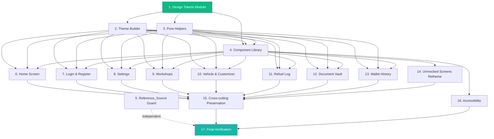

# Implementation Plan

## Overview

This plan is organized so that the foundation (tokens → theme → component library) is in place before any screen redesign starts. Property-based tests for pure helpers are written **before** the helpers' consumers depend on them so contracts are locked early. Screens are then redesigned in waves, with the unmocked screens batched at the end. Each task references the requirements it implements and, where applicable, the design property it validates.

Conventions:
- Test framework: Flutter's built-in test runner; property-based tests use `glados`. Each property test runs a minimum of 100 iterations and carries a `// Feature: figma-ui-redesign, Property N: <text>` tag comment.
- Mocks: `mocktail` for service interfaces.
- All file paths are relative to the repo root.
- Tasks marked **[PBT]** are property-based tests.

## Task Dependency Graph

The numbered groups below are organized so dependencies flow top-to-bottom. Foundation work in groups 1–3 must complete before screens are redesigned. The component library (group 4) depends on tokens + helpers. Screen groups 6–13 each depend on groups 1–4. Group 5 (reference-source guard) is independent and can land at any time. Group 14 (unmocked screens) depends on group 4. Group 15 (cross-cutting preservation) and group 16 (accessibility) run alongside screen groups; their tests depend on the screens being implemented. Group 17 is the final verification gate.

```json
{
  "waves": [
    {
      "name": "Wave 1: Foundation",
      "tasks": [
        "1.1", "1.2", "1.3", "1.4", "1.5", "1.6", "1.7", "1.8",
        "2.1", "2.2", "2.3", "2.4", "2.5", "2.6", "2.7", "2.8", "2.9", "2.10", "2.11",
        "3.1", "3.2", "3.3", "3.4", "3.5", "3.6", "3.7", "3.8", "3.9", "3.10", "3.11", "3.12", "3.13", "3.14", "3.15",
        "5.1", "5.2", "5.3"
      ]
    },
    {
      "name": "Wave 2: Component Library",
      "tasks": [
        "4.1", "4.2", "4.3", "4.4", "4.5", "4.6", "4.7", "4.8", "4.9", "4.10", "4.11", "4.12", "4.13", "4.14", "4.15"
      ]
    },
    {
      "name": "Wave 3: Improved Screens",
      "tasks": [
        "6.1", "6.2", "6.3", "6.4", "6.5",
        "7.1", "7.2", "7.3", "7.4", "7.5", "7.6", "7.7", "7.8", "7.9",
        "8.1", "8.2", "8.3", "8.4", "8.5", "8.6", "8.7", "8.8", "8.9", "8.10", "8.11", "8.12", "8.13",
        "9.1", "9.2", "9.3", "9.4", "9.5", "9.6", "9.7", "9.8", "9.9", "9.10", "9.11", "9.12", "9.13", "9.14", "9.15",
        "10.1", "10.2", "10.3", "10.4", "10.5", "10.6", "10.7", "10.8",
        "11.1", "11.2", "11.3", "11.4", "11.5", "11.6", "11.7", "11.8", "11.9", "11.10", "11.11", "11.12", "11.13", "11.14", "11.15",
        "12.1", "12.2", "12.3", "12.4", "12.5", "12.6", "12.7",
        "13.1", "13.2", "13.3", "13.4", "13.5", "13.6", "13.7"
      ]
    },
    {
      "name": "Wave 4: Unmocked Screens Retheme",
      "tasks": [
        "14.1", "14.2", "14.3", "14.4", "14.5", "14.6", "14.7", "14.8", "14.9", "14.10"
      ]
    },
    {
      "name": "Wave 5: Cross-cutting + Accessibility",
      "tasks": [
        "15.1", "15.2", "15.3", "15.4", "15.5", "15.6", "15.7", "15.8",
        "16.1", "16.2", "16.3", "16.4", "16.5", "16.6"
      ]
    },
    {
      "name": "Wave 6: Final Verification",
      "tasks": [
        "17.1", "17.2", "17.3", "17.4"
      ]
    }
  ]
}
```

Visual reference of the same dependency structure:



## Tasks

### 1. Foundation: Design Tokens Module

- [x] 1.1 Create `lib/core/theme/tokens/` folder with one file per Token_Set
  - Add `app_colors.dart`, `app_spacing.dart`, `app_radii.dart`, `app_typography.dart`, `app_shadows.dart`, `app_motion.dart`, plus a `tokens.dart` barrel export.
  - Each file declares a private-constructor token class with all members as `static const`.
  - _Requirements: 1.1, 1.9, 1.12_

- [x] 1.2 Implement `AppColors` token class
  - Declare brand palette (`emerald500`, `emerald600`, `teal400`, `teal500`), semantic colors (`success`, `warning`, `error`, `info`), light neutrals (`lightBackground`, `lightForeground`, `lightCard`, `lightMuted`, `lightBorder`), dark neutrals (`darkBackground`, `darkForeground`, `darkCard`, `darkPopover`, `darkBorder`), and surface opacities (`surfaceSubtle`, `surfaceMedium`, `surfaceProminent`).
  - Pre-compute the dark-mode neutrals from `oklch(0.145 0 0)`, `oklch(0.985 0 0)`, `oklch(0.269 0 0)` using a one-time OKLCH→sRGB conversion; freeze the result as `Color(0xFFRRGGBB)` literals.
  - _Requirements: 1.2, 1.3, 2.1, 2.2_

- [x] 1.3 Implement `AppSpacing`, `AppRadii`, `AppMotion` token classes
  - `AppSpacing.{xs,sm,md,lg,xl,xxl,xxxl,xxxxl} = {4,8,12,16,24,32,40,48}`.
  - `AppRadii.{small,medium,large,xLarge} = {12,16,24,32}`.
  - `AppMotion.{fast,normal,slow} = Duration(150,300,500ms)`, `standard = Curves.easeInOut`, `emphasized = Curves.easeOutCubic`.
  - _Requirements: 1.4, 1.5, 1.11_

- [x] 1.4 Implement `AppTypography` token class
  - Seven `static const TextStyle` entries (`display`, `headlineLarge`, `headline`, `title`, `bodyLarge`, `body`, `label`) with the spec'd `fontSize` and `fontWeight`.
  - Confirm `body.fontSize == 12` and `label.fontSize == 10` (accessibility floors).
  - _Requirements: 1.6, 13.1, 13.2_

- [x] 1.5 Implement `AppShadows` token class with light values
  - Four `static const List<BoxShadow>` lists (`small`, `medium`, `large`, `xLarge`) matching the Reference_Source values exactly.
  - Add `static const double darkOpacityMultiplier = 2.5`.
  - _Requirements: 1.7_

- [x] 1.6 Implement `lib/core/theme/color_utils.dart` with `scaleShadowOpacity`
  - Pure function `List<BoxShadow> scaleShadowOpacity(List<BoxShadow> input, double factor)` that returns a new list whose each shadow has color opacity equal to `(originalOpacity * factor).clamp(0.0, 1.0)`, all other fields preserved.
  - _Requirements: 1.8_

- [x] 1.7 **[PBT]** Property test: dark-mode shadow opacity scaling (Property 1)
  - Use `glados` to generate `BoxShadow` instances with random opacity, blur, offset and assert `scaleShadowOpacity([s], 2.5)` opacity equals `min(1.0, opacity * 2.5)` and all other fields are preserved.
  - 100+ iterations; tag `// Feature: figma-ui-redesign, Property 1: ...`.
  - _Requirements: 1.8_

- [x] 1.8 Unit tests for token equality + structural smoke checks
  - Equality assertions per named color, opacity, spacing, radius, typography, shadow, motion token (Requirements 1.2–1.7, 1.11).
  - Smoke test: `import` each Token_Set class and confirm every documented member is reachable.
  - Lint guard: a custom Dart analyzer rule rejects any non-`static const` field added to the token classes.
  - _Requirements: 1.1, 1.9, 1.12_

### . Foundation: Theme Builder

- [x] 2.1 Create `ThemeExtension` adapters
  - In `lib/core/theme/tokens/`, add `AppColorsExt`, `AppSpacingExt`, `AppRadiiExt`, `AppShadowsExt`, `AppMotionExt`, `AppTypographyExt`, each extending `ThemeExtension<T>` and exposing every token defined in Tasks 1.2–1.5 as instance fields.
  - Implement `copyWith` and `lerp` (return `this`; tokens are non-tweenable).
  - Provide `.light()` and `.dark()` named constructors where token values differ between modes (only `AppColorsExt` and `AppShadowsExt`).
  - _Requirements: 2.11_

- [x] 2.2 Implement `derivePalette(Color seed)` in `color_utils.dart`
  - Returns a record `({Color emerald500, Color emerald600, Color teal400, Color teal500})`.
  - For the canonical `#10B981` seed, output equals the `AppColors.{emerald500, emerald600, teal400, teal500}` literals.
  - For other preset seeds, derive a four-stop gradient palette with matching hue and lightness steps.
  - _Requirements: 2.6_

- [x] 2.3 Implement `contrastRatio(Color fg, Color bg)` in `color_utils.dart`
  - Pure function using WCAG 2.1 relative luminance formula. Returns a `double` in `[1.0, 21.0]`.
  - _Requirements: 13.5, 13.6_

- [x] 2.4 Rewrite `lib/core/theme/app_theme.dart`
  - Replace existing `AppTheme.buildTheme(seed, brightness)` with token-driven `ThemeData` construction.
  - Wire `textTheme` slots to `AppTypography` entries (Requirement 2.10).
  - Apply `AppShadows.darkOpacityMultiplier` via `scaleShadowOpacity` for the dark variant.
  - Register all six `ThemeExtension`s on `ThemeData.extensions`.
  - Configure `appBarTheme`, `inputDecorationTheme`, `elevatedButtonTheme`, `cardTheme`, `bottomSheetTheme`, `snackBarTheme`, `dialogTheme` to read from tokens.
  - _Requirements: 1.8, 2.1, 2.2, 2.10, 2.11_

- [x] 2.5 Add atomic `_buildThemePair` wrapper
  - Pure function returning `(ThemeData light, ThemeData dark)` from a single seed.
  - Caller in `lib/app.dart` caches the last successful pair; on exception, re-uses the cached pair without partial updates.
  - _Requirements: 2.6, 2.8_

- [x] 2.6 Update `lib/app.dart` to validate preset color before applying
  - Wrap `ThemeService.setPrimaryColor(color)` interactions so non-preset colors are rejected and surface an error to the caller; existing themes retained.
  - Note: validation lives at the call sites that expose color choices (Settings) since `ThemeService` itself accepts any `Color` today; the redesign adds a guard at the public interaction surface.
  - _Requirements: 2.7_

- [x] 2.7 **[PBT]** Property test: atomic theme rebuild for presets (Property 2)
  - Generate any preset color from `ThemeService.presets.values`, call the validated setter, pump one frame, assert both `theme` and `darkTheme` carry the same seed-derived `(emerald500, emerald600, teal400, teal500)` palette in their `AppColorsExt`, and that all other token extensions are unchanged across light and dark.
  - _Requirements: 2.6_

- [x] 2.8 **[PBT]** Property test: non-preset rejection preserves themes (Property 3)
  - Generate any random `Color` and verify it is rejected by the preset validator (skip presets in the generator). Capture the `(theme, darkTheme)` pair before the call and assert it is byte-identical after; assert an error is surfaced to the caller.
  - _Requirements: 2.7, 2.8_

- [x] 2.9 Widget tests for `themeMode` switching
  - Switching `themeMode` between `light/dark/system` re-renders `MaterialApp` with the matching `ThemeData` on the next frame; `system` tracks `MediaQuery.platformBrightness` changes.
  - _Requirements: 2.3, 2.4, 2.5_

- [x] 2.10 Unit tests for theme neutrals, text theme, and extensions
  - Light neutrals match exact hex literals; dark neutrals within ±1 per channel of OKLCH conversion; text theme slots match `AppTypography` `fontSize`/`fontWeight`; all six extensions present and non-null.
  - _Requirements: 2.1, 2.2, 2.10, 2.11_

- [x] 2.11 Theme rebuild performance benchmark (integration)
  - Measure `_buildThemePair(seed)` end-to-end for each preset on the target Android emulator; assert ≤ 200 ms per execution.
  - _Requirements: 2.9_

### . Foundation: Pure Helpers

- [x] 3.1 Create `lib/core/util/greeting.dart`
  - Pure function `String getGreeting(int hour24, String? firstName)` implementing the rule from Requirement 4.1 with the `there` fallback from Requirement 4.2.
  - _Requirements: 4.1, 4.2_

- [x] 3.2 **[PBT]** Property test: greeting function (Property 4)
  - Generate `hour ∈ [0, 23]` and any `String? firstName` (including null, empty, whitespace-only, and arbitrary strings); assert the returned string starts with the correct greeting prefix and ends with `firstName.trim()` or `"there"` per the rule.
  - _Requirements: 4.1, 4.2_

- [x] 3.3 Create `lib/core/util/format_bytes.dart`
  - Pure function `String formatBytes(int bytes)` returning a one-decimal-place value with unit `B`, `KB`, or `MB` selected by power-of-1024 thresholds.
  - _Requirements: 10.3_

- [x] 3.4 **[PBT]** Property test: `formatBytes` unit selection (Property 21)
  - Generate `bytes ∈ [0, 10^12]`; assert the returned suffix matches the threshold rule and the numeric portion equals `bytes / divisor` rounded to one decimal.
  - _Requirements: 10.3_

- [x] 3.5 Create `lib/core/util/expiry.dart`
  - `enum ExpiryStatus { ok, warning, error, noExpiry }` and pure function `ExpiryStatus expiryStatusOf(DateTime? expiry, DateTime now)` per the four-branch rule.
  - _Requirements: 10.4, 10.5_

- [x] 3.6 **[PBT]** Property test: `expiryStatusOf` classification (Property 22)
  - Generate `(expiry, now)` pairs covering null, far-past, recent-past, future-near, future-far; assert the returned status matches the documented branch.
  - _Requirements: 10.4, 10.5_

- [x] 3.7 Create `lib/core/util/search_filter.dart`
  - Pure functions `List<Workshop> filterWorkshops(List<Workshop> all, String query, String category)` and `List<Document> filterDocuments(List<Document> all, String query, String category)` implementing the case-insensitive substring AND category-match predicate, preserving original order.
  - _Requirements: 7.3, 10.1_

- [x] 3.8 **[PBT]** Property test: filter correctness (Property 12)
  - Generate random workshop/document lists, query strings, and category values. Assert every returned element matches the predicate, every non-returned element fails it, and order is preserved.
  - _Requirements: 7.3, 10.1_

- [x] 3.9 Create `lib/core/util/refuel_math.dart`
  - Pure function `double kmPerLiter(double distanceKm, double liters)` returning `0` when `liters <= 0`, else `distanceKm / liters`.
  - _Requirements: 9.7_

- [x] 3.10 Create `lib/core/util/clamp_percentage.dart`
  - Pure function `int? clampPercentage(double? value)` returning `null` for non-finite or null input, else `value.clamp(0.0, 100.0).round()`.
  - _Requirements: 4.3, 8.2_

- [x] 3.11 **[PBT]** Property test: percentage clamp (Property 5)
  - Generate any `double` (including `NaN`, ±infinity, negatives, > 100); assert the result is null or in `[0, 100]` per the rule.
  - _Requirements: 4.3, 8.2_

- [x] 3.12 Create `lib/core/util/in_flight_gate.dart`
  - Reusable `InFlightGate` controller with `Future<T?> run<T>(Future<T> Function() action)` that drops re-entrant calls while a previous call is in flight.
  - _Requirements: 4.8, 5.7_

- [x] 3.13 **[PBT]** Property test: in-flight gate single-effect (Property 6)
  - Generate `n ∈ [1, 100]` rapid `run` calls during in-flight; assert exactly one downstream effect was observed.
  - _Requirements: 4.8, 5.7_

- [x] 3.14 Create `lib/core/util/single_select_controller.dart`
  - `SingleSelectController<T>` with `T? selected`, `void select(T)`, list-of-values constraint; emits change notifications.
  - _Requirements: 7.2, 10.1, 11.4_

- [x] 3.15 **[PBT]** Property test: chip single-selection invariant (Property 11)
  - Generate any list of values and any tap sequence; assert exactly one is selected at all times and equals the most-recent tap.
  - _Requirements: 7.2, 10.1, 11.4_

### . Component Library

- [x] 4.1 Scaffold `lib/widgets/ui/` directory with barrel export `ui.dart` and `types.dart`
  - `types.dart` defines `enum FeedbackKind`, `enum BadgeKind`, `class NavItem`, plus other shared enums used across components.
  - _Requirements: 3.1_

- [x] 4.2 Implement `AppPrimaryButton`
  - Gradient `emerald500→teal400`, scale 0.98x on press, 1.0x on release, transition in 100 ms; disabled state ignores gestures and applies disabled treatment.
  - Read every visual constant from token extensions; no hard-coded literals.
  - _Requirements: 3.2, 3.10, 3.11, 3.12_

- [x] 4.3 Implement `AppSecondaryButton`, `AppIconButton`, `AppGradientButton`
  - Same gesture/disabled rules as `AppPrimaryButton`; `AppIconButton` requires `semanticsLabel`; `AppGradientButton` supports `isLoading` showing `AppSpinner` and ignoring taps.
  - _Requirements: 3.10, 3.11, 3.12, 13.8_

- [x] 4.4 Implement `AppTextField`
  - 2-pixel border in border color resting; emerald500 when focused; error when `errorText != null`; `enabled=false` rejects pointer/keyboard input; supports `prefixIcon`, `suffix`, `obscureText`.
  - _Requirements: 3.3, 3.4, 3.5, 3.6, 3.11_

- [x] 4.5 Implement `AppBadge`, `AppFeedbackBanner`
  - `AppFeedbackBanner` accepts `kind ∈ {success, error, warning, info}` and applies matching token colors.
  - _Requirements: 3.7, 3.11_

- [x] 4.6 Implement `AppCard`, `AppListTile`, `AppSectionHeader`
  - `AppCard`: surface + border + small shadow + `AppRadii.large`. `AppListTile`: token-driven replacement for `ListTile`. `AppSectionHeader`: uppercased label.
  - _Requirements: 3.11_

- [x] 4.7 Implement `AppFloatingBottomNav`
  - Backdrop blur sigma `12`, supports 3–5 items (asserted), equal item widths, active item highlighted with brand gradient.
  - _Requirements: 3.8, 3.10, 3.11_

- [x] 4.8 Implement `AppBottomSheet`
  - Static `show<T>(...)` helper with drag handle, top-rounded `AppRadii.large`, animation duration 280 ms.
  - _Requirements: 3.9, 3.11_

- [x] 4.9 Implement `AppEmptyState`, `AppSkeletonLoader`, `AppSpinner`
  - Token-driven empty/loading primitives.
  - _Requirements: 3.11, 11.8_

- [x] 4.10 Implement `AppToggleSwitch`, `AppCategoryChip`, `AppPhoneStatusBar`
  - `AppToggleSwitch`: brand-gradient track when on; `AppCategoryChip`: optional trailing price text; `AppPhoneStatusBar`: thin status bar accent.
  - _Requirements: 3.11_

- [x] 4.11 Implement `AppHealthGauge`
  - Wraps the existing `_HealthGaugePainter` arc rendering from `vehicle_health_gauge.dart`. `percentage = null` → `--%` placeholder. Reads colors and durations from tokens.
  - _Requirements: 3.11, 4.3, 4.4, 8.2, 8.3_

- [x] 4.12 Hit-target wrapper for all interactive widgets
  - Internal `_HitTargetWrapper` mixin/widget that pads the gesture region to ≥ 48x48 logical pixels even when the visual is smaller. Apply to every interactive Component_Library widget.
  - _Requirements: 3.10, 13.3_

- [x] 4.13 Widget tests per Component_Library widget
  - Per widget: render in light + dark, assert visual contracts (border color, gradient stops, blur sigma, animation durations, disabled state, `errorText`, semantics label, hit area ≥ 48x48).
  - _Requirements: 3.2–3.12, 13.3, 13.8, 13.9_

- [x] 4.14 **[PBT]** Property test: hit-target floor (Property 23)
  - Generate any Component_Library interactive widget at any visual size in `[1, 200] x [1, 200]`; assert rendered gesture region size ≥ 48x48.
  - _Requirements: 13.3_

- [x] 4.15 **[PBT]** Property test: contrast ratio for token palette pairings (Property 24)
  - Generate documented `(fg, bg)` token pairings used in screens/components; assert `contrastRatio` ≥ 4.5 (or ≥ 3.0 for large/bold) for every non-disabled pair in both light and dark.
  - _Requirements: 13.5_

### . Reference_Source Guard

- [x] 5.1 Create `tool/reference_source_guard.dart`
  - Walks `lib/`, `pubspec.yaml`, `pubspec.lock`, build configurations, and tooling for any string containing `UI Improvement Suggestion`. Uses Dart `analyzer` to inspect `ImportDirective`, `ExportDirective`, `PartDirective`, and string literals flowing into `rootBundle.load`, `File`, `Image.asset`, etc., resolving each reference. Exits non-zero on any leak.
  - _Requirements: 15.1, 15.2, 15.4, 15.5_

- [x] 5.2 Wire guard into CI and analysis
  - Add `dart run tool/reference_source_guard.dart` step to the CI workflow before `flutter build` and `flutter test`. Update `analysis_options.yaml` to include the project's analyzer plugins where applicable.
  - Verify the existing `.gitignore` entry for `UI Improvement Suggestion/` remains in place.
  - _Requirements: 15.3, 15.5, 15.6_

- [x] 5.3 Negative-path test for the guard
  - Inject a temporary leak file under a CI-scratch directory (not the real `lib/`) and assert `dart run tool/reference_source_guard.dart` exits non-zero. Remove the scratch file.
  - _Requirements: 15.6_

### . Improved Screen — Home

- [x] 6.1 Refactor `lib/screens/home_screen.dart` cockpit body
  - Break out `_GreetingHeader`, `_VehicleHealthHero`, `_WalletVaultRow`, `_UpcomingAppointmentCard`, `_QuickActionsRow` into `lib/screens/home/_widgets.dart`.
  - Greeting uses `getGreeting(DateTime.now().hour, ProfileService.instance.firstName)`.
  - Vehicle health hero wraps `AppHealthGauge` with `clampPercentage(VehicleInsights.instance...)`.
  - Wallet/vault row uses `Row(children: [Expanded(flex: 2, ...), Expanded(flex: 1, ...)])` for the 2/3 + 1/3 split.
  - Upcoming-appointment populated/empty branches; quick-actions row uses existing handlers.
  - _Requirements: 4.1, 4.2, 4.3, 4.4, 4.5, 4.11, 4.12_

- [x] 6.2 Replace bottom navigation with `AppFloatingBottomNav`
  - Five entries in order `Cockpit, Shops, My Car, Refuel, Wallet`, default index 0; tap updates `HomeScreen.activeTabNotifier` (unchanged API).
  - _Requirements: 4.6_

- [x] 6.3 Wire wallet `Top Up` action through `InFlightGate`
  - `Top Up` tap goes through a per-screen `InFlightGate` that ensures one `WalletTopUpSheet` is presented per gesture, even with rapid taps.
  - _Requirements: 4.7, 4.8_

- [x] 6.4 Preserve onboarding flag and service lifecycle
  - Keep `_checkFirstLaunchOnboarding` reading/writing `has_seen_onboarding_guide` exactly as today. Confirm `initState` invokes `ActivityRecognitionService.instance.startListening()`, `LocationTracker`, and journey-tracking hooks in the same order.
  - _Requirements: 4.9, 4.10, 14.6, 14.7_

- [x] 6.5 Widget tests for home screen
  - Layout: greeting, gauge with placeholder branch, wallet/vault split, five-entry bottom nav, populated/empty appointment branches, quick-actions navigation.
  - Onboarding: first-mount-with-flag-false vs flag-true branches.
  - _Requirements: 4.4, 4.5, 4.6, 4.9, 4.10, 4.11, 4.12_

### . Improved Screens — Login & Register

- [x] 7.1 Rebuild `lib/screens/login_screen.dart` layout
  - Hero block (128×128, radius 24, gradient, car emoji), email + password `AppTextField`s with prefix icons and 2-pixel borders, `Sign In` `AppGradientButton`, `Forgot password?` link, `Sign up free` link.
  - _Requirements: 5.1, 5.2_

- [x] 7.2 Wire password visibility toggle
  - Initial state: `obscureText = true`, show-password icon. Tap toggles `obscureText`, swaps icon, preserves controller text.
  - _Requirements: 5.3, 5.4_

- [x] 7.3 **[PBT]** Property test: password visibility toggle round-trip (Property 7)
  - Generate any `String password` and any non-negative even `k`; perform `k` toggles; assert `obscureText` returns to `true` and controller text equals `password`.
  - _Requirements: 5.4_

- [x] 7.4 Wire Sign In through `InFlightGate` and validation
  - Empty-field validation suppresses Firebase call and shows inline `errorText`. Successful tap goes through gate to `signInWithEmailAndPassword` with entered values; existing success/error handling preserved.
  - _Requirements: 5.5, 5.6, 5.7_

- [x] 7.5 **[PBT]** Property test: in-flight sign-in single Firebase call (Property 6 instance for sign-in)
  - Generate `n` rapid taps during in-flight sign-in; assert exactly one `signInWithEmailAndPassword` mock invocation.
  - _Requirements: 5.7_

- [x] 7.6 Wire `Forgot password?` and `Sign up free`
  - Forgot password triggers existing reset flow without modifying field values. Sign up free pushes `RegisterScreen.routeName`.
  - _Requirements: 5.8, 5.9_

- [x] 7.7 Implement biometric button conditional rendering
  - Show `Biometric` button only when `LocalAuthentication.canCheckBiometrics == true` and a biometric session token exists in SharedPreferences. Tap triggers existing biometric login.
  - _Requirements: 5.11, 5.12, 5.13_

- [x] 7.8 Restyle `lib/screens/register_screen.dart`
  - Apply same hero, typography, `AppTextField`, and `AppGradientButton` as login. Preserve existing form fields, validation, and Firebase create-user call.
  - _Requirements: 5.10_

- [x] 7.9 Widget + integration tests for login & register
  - Hero/field layout, validation, in-flight loading state, forgot-password preservation, navigation to register, biometric branches, register parity with login.
  - _Requirements: 5.1, 5.2, 5.3, 5.5, 5.6, 5.8, 5.9, 5.10, 5.11, 5.13_

### . Improved Screen — Settings

- [x] 8.1 Rewrite `lib/screens/settings_screen.dart` section structure
  - Render `PROFILE`, `APPEARANCE`, `NOTIFICATIONS`, `PRIVACY & SECURITY`, `DATA & STORAGE`, `PREFERENCES`, `ABOUT & SUPPORT`, then a final `Sign Out` button — in this exact order.
  - _Requirements: 6.1_

- [x] 8.2 Build `PROFILE` section
  - Avatar with overlaid camera `AppIconButton`, display-name `AppTextField` (`maxLength: 50`, `minLength: 1`), phone `AppTextField` (digits only, length 7–15), `Save Profile` `AppGradientButton`. Bind to `ProfileService.instance`.
  - _Requirements: 6.2_

- [x] 8.3 Add unsaved-changes banner driven by dirty state
  - Compute `_isDirty = (nameController.text != persistedName) || (phoneController.text != persistedPhone)` via `Listenable.merge`. Render `AppFeedbackBanner(kind: warning)` at the top of the scroll view when dirty; remove when matched (save or revert).
  - _Requirements: 6.3_

- [x] 8.4 **[PBT]** Property test: profile dirty banner visibility (Property 8)
  - Generate `(persistedName, persistedPhone, editedName, editedPhone)` tuples; assert banner present iff `(editedName, editedPhone) != (persistedName, persistedPhone)`.
  - _Requirements: 6.3_

- [x] 8.5 Build `APPEARANCE` section with dark mode + 4-column gradient swatches
  - `AppToggleSwitch` for dark mode bound to `ThemeService.setThemeMode`. 4-column grid of 8 gradient swatches built from `ThemeService.presets.values.toList()`.
  - _Requirements: 6.4_

- [x] 8.6 Wire swatch selection through validated setter
  - Tap swatch → call validated `ThemeService.setPrimaryColor(c)` (rejects non-presets per Task 2.6). Render checkmark on exactly the selected swatch.
  - _Requirements: 6.5_

- [x] 8.7 **[PBT]** Property test: swatch single-checkmark invariant (Property 9)
  - Generate any sequence of swatch index taps; assert exactly one checkmark, on the most recently tapped index.
  - _Requirements: 6.5_

- [x] 8.8 Build `NOTIFICATIONS` section with three toggles
  - `AppToggleSwitch` for Maintenance Reminders, Booking Confirmations, Weekly Reports; persist via existing notification preference store.
  - _Requirements: 6.6_

- [x] 8.9 **[PBT]** Property test: notifications toggle round-trip (Property 10)
  - Generate any sequence of toggles across the three switches; assert persisted store value equals the toggle's most-recent in-memory value after each operation.
  - _Requirements: 6.6_

- [x] 8.10 Build `PRIVACY & SECURITY`, `DATA & STORAGE`, `PREFERENCES`, `ABOUT & SUPPORT` sections
  - Use existing data sources and handlers; render via `AppListTile` and `AppSectionHeader`.
  - _Requirements: 6.1_

- [x] 8.11 Wire `Sign Out` confirmation via `AppBottomSheet`
  - Tap `Sign Out` → present sheet with `Cancel` and `Sign Out` buttons. Cancel dismisses. Sign Out → `FirebaseAuth.instance.signOut()` then navigate to `LoginScreen.routeName`.
  - _Requirements: 6.7, 6.8, 6.9_

- [x] 8.12 Handle `Save Profile` failure
  - Catch `ProfileService.updateProfile` errors; render `AppFeedbackBanner(kind: error)`; retain edited values.
  - _Requirements: 6.10_

- [x] 8.13 Widget + integration tests for settings
  - Section order, profile field validators, dirty banner, swatch grid, sign-out flow, save failure handling.
  - _Requirements: 6.1, 6.2, 6.4, 6.7, 6.8, 6.9, 6.10_

### . Improved Screens — Workshops (Map / List / Detail / My Bookings)

- [x] 9.1 Add `WorkshopCategory` enum and `Workshop.category` mapping
  - `enum WorkshopCategory { all, repair, carWash, parts }`. Map existing workshop docs to the enum without schema migration.
  - _Requirements: 7.2, 14.3, 14.9_

- [x] 9.2 Rewrite `lib/screens/workshop_map_screen.dart` top tab switcher
  - `Browse | My Bookings`, default `Browse`, styled per design.
  - _Requirements: 7.1_

- [x] 9.3 Build Browse tab — search, filter, chips
  - Search `AppTextField` with leading magnifier and trailing filter `AppIconButton`. Horizontal `AppCategoryChip` row `All / Repair / Car Wash / Parts`, default `All`, single-selection via `SingleSelectController`.
  - _Requirements: 7.2_

- [x] 9.4 Wire Browse list through `filterWorkshops`
  - Render filtered list using the pure helper from Task 3.7.
  - _Requirements: 7.3_

- [x] 9.5 Build list/map `viewMode` toggle
  - `viewMode ∈ {list, map}`, default `list`. List → `AppCard` per workshop. Map → existing `GoogleMap` with markers/camera/polylines unchanged.
  - _Requirements: 7.4, 14.5_

- [x] 9.6 Build workshop card content
  - Image, name, rating badge, review count, open/closed status, distance, price range, two specialty chips, `+N more` overflow label, dual `Navigate` + `Book Now` buttons.
  - _Requirements: 7.5_

- [x] 9.7 **[PBT]** Property test: workshop card specialty overflow (Property 13)
  - Generate workshops with random specialty counts `k ≥ 0`; assert rendered chip count = `min(2, k)` and overflow label shows `+max(0, k-2) more` (or absent when `k ≤ 2`).
  - _Requirements: 7.5_

- [x] 9.8 Wire heart favorite toggle with optimistic update
  - Tap heart → update local UI within 100 ms; call `WorkshopFirebaseService.toggleFavorite(id)`. On failure, revert UI fill and surface error.
  - _Requirements: 7.6, 7.7_

- [x] 9.9 **[PBT]** Property test: heart favorite round-trip (Property 14)
  - Generate any tap sequence on a workshop's heart; assert UI fill state equals the persisted favorite state after each tap.
  - _Requirements: 7.6_

- [x] 9.10 Wire workshop card body tap to detail bottom sheet
  - Tap card body → `AppBottomSheet.show(initialHeightFraction: 0.85)` presenting `workshop_detail_screen.dart`. Verify height ≥ 80% of viewport.
  - _Requirements: 7.8_

- [x] 9.11 Rewrite `lib/screens/workshop_detail_screen.dart` content
  - Quick-info grid (`Status` + `Distance`), services chip cloud, opening-hours list, footer `Call` + `Book Now` buttons. Preserve existing telephony and booking flows.
  - _Requirements: 7.9, 7.10, 7.11_

- [x] 9.12 Empty Browse state
  - Search/filter combo with zero matches → `AppEmptyState` while keeping search field and chip row visible and interactive.
  - _Requirements: 7.12_

- [x] 9.13 Build My Bookings tab
  - Populated → cards with `Reschedule` + `Cancel` invoking existing booking-management actions. Empty → `AppEmptyState` with `Browse Workshops` CTA. Mutually exclusive.
  - _Requirements: 7.13, 7.14_

- [x] 9.14 **[PBT]** Property test: My Bookings populated/empty mutual exclusion (Property 15)
  - Generate any list of bookings (including empty); assert exactly one of the two states is rendered.
  - _Requirements: 7.14_

- [x] 9.15 Widget + integration tests for workshops
  - Tab default, search/filter, viewMode toggle, card content, heart toggle, detail sheet height, empty states, telephony + booking call mocks.
  - _Requirements: 7.1, 7.2, 7.4, 7.8, 7.10, 7.11, 7.12, 7.13_

### . Improved Screens — Vehicle & Vehicle Customizer

- [x] 10.1 Rewrite `lib/screens/vehicle_screen.dart` hero card
  - Linear gradient `#2563EB → #4338CA` (top-left to bottom-right), plate, car emoji, top-right `AppIconButton(Icons.edit)` overlay.
  - _Requirements: 8.1_

- [x] 10.2 Build four-tile health metrics grid
  - Engine, Brakes, Battery, Tires tiles using `clampPercentage` from Task 3.10 over `VehicleInsights.instance.watchlistItems`.
  - _Requirements: 8.2, 8.3_

- [x] 10.3 Build maintenance history list
  - `AppListTile`-styled list ordered most-recent-first by `date`. Empty → `AppEmptyState`.
  - _Requirements: 8.4, 8.6_

- [x] 10.4 **[PBT]** Property test: maintenance history descending sort (Property 16)
  - Generate any list of maintenance entries; assert rendered order is non-increasing by `date`.
  - _Requirements: 8.4_

- [x] 10.5 Build upcoming tasks list
  - Priority indicator color: `high → AppColors.error`, `medium → AppColors.warning`, `low → AppColors.info`. Empty → `AppEmptyState`.
  - _Requirements: 8.5, 8.7_

- [x] 10.6 Wire Edit button to vehicle customizer
  - Tap → `Navigator.pushNamed(context, VehicleCustomizerScreen.routeName)` with redesigned tokens; existing customizer logic preserved.
  - _Requirements: 8.8_

- [x] 10.7 Restyle `lib/screens/vehicle_customizer_screen.dart`
  - Apply `AppPrimaryButton`, `AppGradientButton`, `AppTextField`, `AppCard`, `AppFeedbackBanner` while keeping existing form fields, validation, save behavior.
  - _Requirements: 8.9_

- [x] 10.8 Widget + integration tests for vehicle screens
  - Hero gradient, tile clamps, list orderings, priority colors, empty states, edit navigation, customizer save call signature parity.
  - _Requirements: 8.1, 8.3, 8.5, 8.6, 8.7, 8.9_

### . Improved Screen — Refuel Log

- [x] 11.1 Rewrite `lib/screens/refuel_log_screen.dart` top tab switcher
  - `Log / History / Insights`, default `Log`.
  - _Requirements: 9.1_

- [x] 11.2 Build Log tab fields with positive-decimal filter
  - Three `AppTextField`s (distance km, liters, price/L) with `keyboardType` decimal and an `inputFormatters` list permitting only `^[0-9]*\.?[0-9]*$`.
  - _Requirements: 9.2_

- [x] 11.3 **[PBT]** Property test: positive-decimal input filter (Property 17)
  - Generate any string; type into the field; assert resulting controller text matches the regex.
  - _Requirements: 9.2_

- [x] 11.4 Build fuel-type chip row with preset prices
  - `AppCategoryChip` row `Budi95 / RON95 / RON97 / Diesel`. Each chip displays its preset price below the label.
  - _Requirements: 9.2_

- [x] 11.5 Wire chip selection to pre-fill price field
  - Selecting a chip overwrites the price field with the preset value while keeping the field editable.
  - _Requirements: 9.3_

- [x] 11.6 Wire `Save Refuel` validation and persistence
  - Valid input → existing refuel-log database service call + form reset. Invalid → no DB call + per-field validation indicators.
  - _Requirements: 9.4, 9.5_

- [x] 11.7 **[PBT]** Property test: Save Refuel valid round-trip (Property 18)
  - Generate valid `(distance, liters, price, fuelType)`; tap Save; assert one DB call with exact entry and form fields cleared.
  - _Requirements: 9.4_

- [x] 11.8 **[PBT]** Property test: Save Refuel invalid rejects (Property 19)
  - Generate invalid combinations; tap Save; assert no DB call and validation visible on each invalid field.
  - _Requirements: 9.5_

- [x] 11.9 Handle DB persistence failure
  - Catch DB errors; surface error indicator; retain field values.
  - _Requirements: 9.6_

- [x] 11.10 Build History tab cards
  - `AppCard` per entry with date, distance, liters, fuel-type chip, efficiency `kmPerLiter(distance, liters)` (two decimals or `–`), total cost, station; ordered most-recent-first.
  - _Requirements: 9.7_

- [x] 11.11 **[PBT]** Property test: History sort + efficiency rendering (Property 20)
  - Generate random refuel entries; assert order is descending by date AND each card's efficiency text equals `kmPerLiter(distance, liters)` formatted correctly.
  - _Requirements: 9.7_

- [x] 11.12 Build History empty state
  - Zero entries → `AppEmptyState` with no-entries message.
  - _Requirements: 9.8_

- [x] 11.13 Build Insights tab
  - Wrap existing `FuelChart` in `AppCard` with redesigned typography and spacing; preserve chart data source.
  - _Requirements: 9.9_

- [x] 11.14 Build Insights empty state
  - Zero entries → `AppEmptyState`.
  - _Requirements: 9.10_

- [x] 11.15 Widget + integration tests for refuel
  - Tab default, input filters, chip pre-fill, valid/invalid save, DB failure path, History order + efficiency, Insights wrap, empty states.
  - _Requirements: 9.1, 9.3, 9.6, 9.8, 9.9, 9.10_

### . Improved Screen — Document Vault

- [x] 12.1 Rewrite `lib/screens/document_vault_screen.dart` search + chip row
  - Top `AppTextField` search; `AppCategoryChip` row `All / Insurance / Tax / Receipt / Warranty`, default `All`, single-selection.
  - _Requirements: 10.1_

- [x] 12.2 Wire filter through `filterDocuments` and chip controller
  - Filter list using `filterDocuments` (Task 3.7) with current query and category.
  - _Requirements: 10.1_

- [x] 12.3 Build list/grid `viewMode` toggle
  - Default `list`; toggle persists for the screen session within `_DocumentVaultScreenState`.
  - _Requirements: 10.2_

- [x] 12.4 Build document card
  - Title with ellipsis, category badge, expiry date or `No expiry`, file size via `formatBytes`, expiry status indicator via `expiryStatusOf`.
  - _Requirements: 10.3, 10.4, 10.5_

- [x] 12.5 Wire floating add button to bottom sheet form
  - Tap → `AppBottomSheet.show(...)` containing existing add-document form. Preserve upload, validation, Firestore persistence.
  - _Requirements: 10.6_

- [x] 12.6 Handle add-document submission failure
  - Validation or Firestore failure → keep sheet open, retain entered values, display error indication identifying the cause.
  - _Requirements: 10.7_

- [x] 12.7 Widget + integration tests for vault
  - Search/chip filter, list/grid toggle persistence, card content branches (no expiry, warning, error, ok), floating add Firestore call, submission failure path.
  - _Requirements: 10.1, 10.2, 10.3, 10.6, 10.7_

### . Improved Screen — Wallet History

- [x] 13.1 Rewrite `lib/screens/wallet_history_screen.dart` hero balance card
  - Gradient brand fill, currency-formatted balance via `intl.NumberFormat.currency(locale: 'en_MY', symbol: 'RM ')`, `Top Up` `AppGradientButton`.
  - _Requirements: 11.1_

- [x] 13.2 Build top tab switcher
  - `Overview / Transactions / Insights`, default `Overview` on first open.
  - _Requirements: 11.2_

- [x] 13.3 Build Transactions list with type/status mappings
  - Each transaction → `AppListTile` with type-mapped leading icon color (`top-up → success`, `payment → info`, `refund → warning`) and status-mapped badge (`completed → success`, `pending → warning`, `failed → error`).
  - _Requirements: 11.3_

- [x] 13.4 Build Transactions filter chip row
  - `All / Top-up / Payment / Refund`, default `All`. Filter applied locally over the already-loaded transactions; no fetch on filter change.
  - _Requirements: 11.4_

- [x] 13.5 Wire hero `Top Up` to `WalletTopUpSheet` with error handling
  - Success → `WalletTopUpSheet.show(context)`. Launch failure → `AppFeedbackBanner(kind: error)`, current tab + filter preserved.
  - _Requirements: 11.5, 11.6_

- [x] 13.6 Build empty filtered state and loading state
  - Zero filtered transactions → `AppEmptyState` while chip row remains interactive. During load → `AppSkeletonLoader` for the affected section; no partial/stale rendering.
  - _Requirements: 11.7, 11.8_

- [x] 13.7 Widget + integration tests for wallet
  - Hero balance, default tab, type/status mappings (3 distinct each), filter without fetch, top-up flow + failure path, empty filtered, loading state.
  - _Requirements: 11.1, 11.2, 11.3, 11.4, 11.5, 11.6, 11.7, 11.8_

### . Unmocked Screens — Retheme

- [x] 14.1 Sweep `lib/screens/booking_screen.dart`
  - Replace literal hex/spacing/radius/typography with token references. Swap raw Material widgets to `AppCard`, `AppTextField`, `AppPrimaryButton`/`AppGradientButton`, `AppFeedbackBanner` where equivalent. Render the screen's primary CTA as `AppGradientButton`. Preserve all data sources, controllers, listeners, navigation calls/args.
  - _Requirements: 12.1, 12.2, 12.3, 12.4, 12.5, 12.6_

- [x] 14.2 Sweep `lib/screens/journey_log_screen.dart`
  - Same sweep as 14.1.
  - _Requirements: 12.1–12.6_

- [x] 14.3 Sweep `lib/screens/maintenance_screen.dart`
  - Same sweep as 14.1.
  - _Requirements: 12.1–12.6_

- [x] 14.4 Sweep `lib/screens/notifications_screen.dart`
  - Same sweep as 14.1.
  - _Requirements: 12.1–12.6_

- [x] 14.5 Sweep `lib/screens/splash_screen.dart`
  - Apply tokens; swap to Component_Library where equivalent; preserve splash routing logic.
  - _Requirements: 12.1–12.6_

- [x] 14.6 Sweep `lib/screens/toyyibpay_webview_screen.dart`
  - Apply tokens to chrome (app bar, loading spinner). Preserve existing webview lifecycle and ToyyibPay callback routing.
  - _Requirements: 12.1–12.6, 14.4_

- [x] 14.7 Sweep `lib/screens/trip_planner_screen.dart`
  - Same sweep as 14.1.
  - _Requirements: 12.1–12.6_

- [x] 14.8 Sweep `lib/screens/trip_tracking_screen.dart`
  - Apply tokens; swap to Component_Library where equivalent. Preserve `GoogleMap` markers, camera positioning, and polyline drawing.
  - _Requirements: 12.1–12.6, 14.5_

- [x] 14.9 Static check for hard-coded literals across unmocked screens
  - Add a one-shot AST scan of the eight unmocked screens that flags any hex color, spacing, radius, or `TextStyle` literal whose value matches a token. Run as part of CI.
  - _Requirements: 12.1, 3.11_

- [x] 14.10 Integration tests for unmocked screens — preservation of behavior
  - For each unmocked screen, drive existing user actions and verify same service methods are called with same parameters as the pre-redesign implementation. Confirm route resolution and navigation arguments unchanged.
  - _Requirements: 12.6, 14.1, 14.2, 14.3, 14.5_

### . Cross-cutting — Functional Preservation & SharedPreferences

- [x] 15.1 Confirm `lib/app.dart` route table matches existing route names
  - Every existing route name resolves to its redesigned screen with same transition direction and back-stack behavior.
  - _Requirements: 14.1_

- [x] 15.2 SharedPreferences key audit
  - Add a unit test that exercises theme + onboarding flows and asserts the keys `theme_primary_color`, `theme_mode_index`, `has_seen_onboarding_guide` are read and written with the same names, types, and encodings as today (no migration).
  - _Requirements: 14.7_

- [x] 15.3 Firestore + Firebase Auth call signature parity tests
  - Per affected screen, mock `FirebaseAuth`, `WorkshopFirebaseService`, `JourneyDatabase`, `CarDatabase`, `MarketplaceRepository`, `ProfileService`; drive flows; assert each invocation signature (method + arg types + field set) equals the pre-redesign baseline.
  - _Requirements: 14.2, 14.3_

- [x] 15.4 ToyyibPay parity test
  - Mock ToyyibPay; drive a top-up; assert bill-creation parameters and webview callback routing equal the pre-redesign baseline.
  - _Requirements: 14.4_

- [x] 15.5 Map parity test
  - For workshops and trip tracking, assert marker IDs/positions, camera positioning logic, and polyline coordinates match the pre-redesign fixture.
  - _Requirements: 14.5_

- [x] 15.6 Home initState ordering test
  - Mount `HomeScreen` with order-recording mocks for `ActivityRecognitionService`, `LocationTracker`, and journey-tracking lifecycle; assert call order matches the pre-redesign baseline.
  - _Requirements: 14.6_

- [x] 15.7 Pre-redesign data load test
  - Seed in-memory storage with pre-redesign fixtures; render redesigned screens; assert displayed values match the fixtures (no schema migration required).
  - _Requirements: 14.9_

- [x] 15.8 Cross-cutting failure handling tests
  - For each I/O surface, inject a failure; assert affected screen renders a clear error indicator and the previously persisted data is unchanged.
  - _Requirements: 14.10_

### . Accessibility

- [x] 16.1 Wire `MediaQuery.textScaler` chain through token typography
  - Confirm every typography Token_Set entry routes through `MediaQuery.textScaler` so user text scaling propagates. No direct uses of deprecated `textScaleFactor`.
  - _Requirements: 13.7_

- [x] 16.2 Add `Semantics.label` to every icon-only interactive Component_Library widget
  - `AppIconButton.semanticsLabel` is required (compile-time enforced). Other icon-only widgets expose a `semanticsLabel` parameter.
  - _Requirements: 13.8_

- [x] 16.3 Implement focus indicator for every interactive control
  - Use `Focus`/`FocusableActionDetector`; when focused, render a 2-pixel outline in `AppColors.emerald500` (light) / `AppColors.teal400` (dark) — both contrast against their respective surfaces.
  - _Requirements: 13.9_

- [x] 16.4 Adjacent hit-area spacing audit
  - Per Improved_Screen widget test, walk the rendered tree and assert adjacent interactive bounds have ≥ 8 logical pixels of gap.
  - _Requirements: 13.4_

- [x] 16.5 Text scaling reflow tests
  - For each Improved_Screen, render at `textScaler ∈ {1.0, 1.25, 1.5, 1.75, 2.0}` and assert no `Text` widget overflows.
  - _Requirements: 13.7_

- [x] 16.6 Contrast lint CI step
  - CI step that runs the contrast checker over all documented token pairings and exits non-zero on any violation.
  - _Requirements: 13.5, 13.6_

### . Final Verification

- [x] 17.1 Run `flutter analyze` and `flutter test`
  - All static analysis warnings resolved; all tests (unit, widget, integration, property, accessibility) pass.
  - _Requirements: all_

- [x] 17.2 Run `dart run tool/reference_source_guard.dart`
  - Exits zero. Confirm no Dart import, asset entry, or runtime path resolves into `UI Improvement Suggestion/`.
  - _Requirements: 15.1, 15.2, 15.4, 15.5, 15.6_

- [x] 17.3 Manual smoke pass on Android emulator
  - Launch the app, exercise: splash → login → register → home → workshops (browse + map + detail + my bookings) → vehicle (+ customizer) → refuel (all three tabs) → vault (search + add) → wallet (top up) → settings (theme + sign out). Confirm light + dark themes, theme mode change, primary color change, onboarding first-launch behavior.
  - _Requirements: all_

- [x] 17.4 Verify `.gitignore` and reference folder isolation
  - Confirm `.gitignore` still ignores `UI Improvement Suggestion/`; `pubspec.yaml` has no asset/font/bundle entry resolving into it.
  - _Requirements: 15.2, 15.3_


## Notes

- **Functional preservation is non-negotiable.** Every redesigned screen keeps the same service calls, controllers, listeners, route names, navigation arguments, and SharedPreferences keys as today (Requirement 14). Visual changes must not regress any feature.
- **Reference_Source isolation.** The `UI Improvement Suggestion/` folder stays gitignored and is never imported, asset-bundled, or referenced at runtime. The CI guard (group 5) runs on every analyze, pre-commit, and pipeline run (Requirement 15).
- **PBT scope.** Property-based tests target pure helpers and pure-logic invariants only (`getGreeting`, `formatBytes`, `expiryStatusOf`, filter functions, in-flight gate, single-select controller, percentage clamp, shadow scaling, contrast ratio, hit-target floor, etc.). Widget rendering, Firebase/ToyyibPay/Google Maps integrations, and theme wiring are validated through widget and integration tests with mocks.
- **PBT iteration count.** Every property test runs at least 100 iterations via `glados` defaults (`Glados.defaultMaxRuns = 100`). Each test carries a tag comment in the form `// Feature: figma-ui-redesign, Property N: <text>` referencing the corresponding design property.
- **No data migration.** Pre-redesign data must be readable by the redesigned screens without any migration step (Requirements 14.7, 14.9). Tests in group 15 enforce this with seeded fixtures.
- **Theme atomicity.** When the user changes accent or `ThemeMode`, both light and dark themes update in a single state update. If the theme rebuild throws, the previously applied themes are retained without partial updates (Requirements 2.6, 2.8).
- **Accessibility floors apply globally.** Every interactive surface must have a hit target ≥ 48x48, every text-on-background pair must meet WCAG contrast thresholds, every icon-only control needs a non-empty `Semantics.label`, and text must reflow at scaler factors up to 2.0 (Requirement 13).
- **TypeScript reference is read-only.** Values reproduced from the Reference_Source must be authored directly as Dart constants or widgets in `lib/`. No build step, code generator, or script may read from `UI Improvement Suggestion/` (Requirement 15.4).
